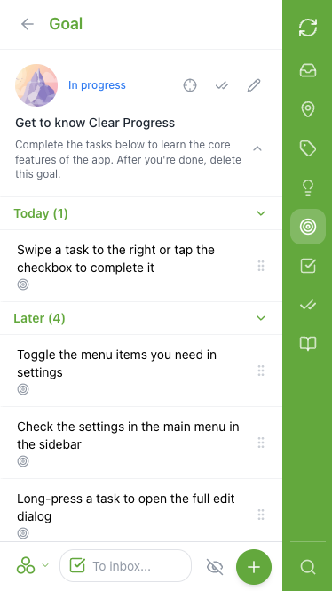
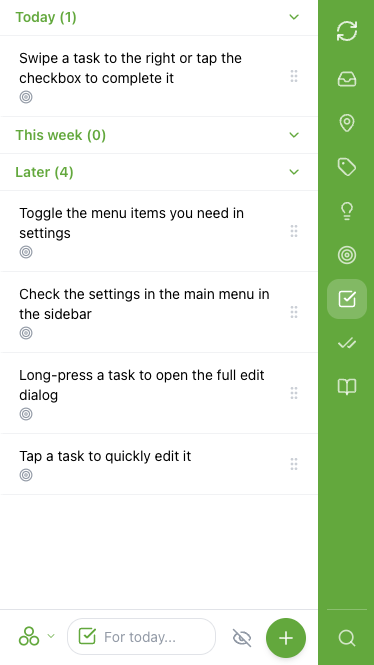
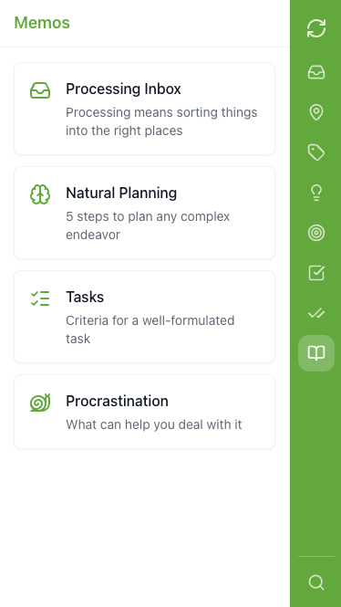
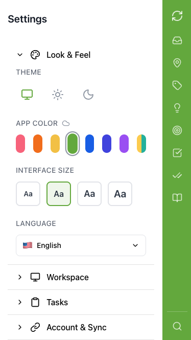

# Clear Progress

[](LICENSE)

[](README.md)
[](README.ru.md)

[](https://github.com/oinsio/clear-progress/actions/workflows/deploy.yml)

Personal task, goal, and idea manager. Built for GTD and Jedi Empty Inbox techniques. Client-first PWA that works offline — your data stays on your device, with optional sync via your own Supabase server.

**[Open the App](https://oinsio.github.io/clear-progress/)**

<p align="center">
  
</p>

## Contents

- [Features](#features)
- [Setting Up Your Server (Supabase)](#setting-up-your-server-supabase)
- [Tech Stack](#tech-stack)
- [Development](#development)
  - [Prerequisites](#prerequisites)
  - [Install and Run](#install-and-run)
  - [Build](#build)
  - [Project Structure](#project-structure)
  - [Testing](#testing)
  - [Documentation](#documentation)
- [License](#license)

## Features

- **Task boxes** — Inbox, Today, Week, Later (GTD-style organization)
- **Goals** — track objectives with statuses (planning, in progress, paused, completed, cancelled)
- **Ideas** — capture ideas before they become tasks or goals
- **Contexts & Categories** — organize tasks by context (@Home, @Office) and life area (Work, Family)
- **Recurring tasks** — flexible repeat rules with skip logic
- **Checklists** — subtasks within tasks
- **Offline-first** — all data stored locally in IndexedDB (Dexie), works without internet
- **Sync** — optional sync between devices via your own Supabase backend
- **Bilingual** — Russian and English interface
- **PWA** — installable on mobile and desktop

<p>
  
  
  
  
</p>

## Setting Up Your Server (Supabase)

The app works fully offline without any server. If you want to sync data between devices, you can set up a free Supabase backend. Each user hosts their own server — your data stays under your control.

### Why Supabase?

Supabase offers a generous free tier that is more than enough for personal use. You get a full PostgreSQL database, Edge Functions for server logic, file storage, and built-in authentication — all at no cost.

### Free Tier Limits

| Resource                  | Limit           |
|---------------------------|-----------------|
| Database                  | 500 MB          |
| File storage              | 1 GB            |
| Monthly active users      | 50,000          |
| Edge Function invocations | 500,000 / month |
| Projects                  | 2 free projects |

> **Note:** Free projects are automatically paused after 1 week of inactivity. You can unpause them from the Dashboard at any time.

### Step 1: Create a Supabase Account and Project

1. Go to [supabase.com/dashboard](https://supabase.com/dashboard) and sign up (GitHub account works)
2. Create a new organization (any name)
3. Create a new project — pick a name, set a database password, and choose a region close to you
4. Wait for the project to finish provisioning (about 1 minute)
5. Note your **Project URL** and **Anon Key** — you will find them in **Settings → API**

### Step 2: Enable an OAuth Provider

Clear Progress supports sign-in via OAuth (Google, GitHub, and [other providers supported by Supabase](https://supabase.com/docs/guides/auth/social-login)).

We recommend using OAuth instead of email/password because the free tier limits the built-in email service to **2 emails per hour**, which makes OTP codes unreliable.

To enable a provider:

1. In the Supabase Dashboard, go to **Authentication → Providers**
2. Choose a provider (e.g., Google or GitHub) and follow the setup instructions:
   - [Google setup guide](https://supabase.com/docs/guides/auth/social-login/auth-google)
   - [GitHub setup guide](https://supabase.com/docs/guides/auth/social-login/auth-github)
   - [All providers](https://supabase.com/docs/guides/auth/social-login)
3. Set the **Site URL** to `https://oinsio.github.io/clear-progress/` (or your own domain if self-hosting the client)
4. Add the same URL to **Redirect URLs**

### Step 3: Deploy the Backend

The backend consists of database tables, RLS policies, and Edge Functions. A deploy script automates everything.

**Prerequisites:**
- [Node.js](https://nodejs.org/) >= 20 and [pnpm](https://pnpm.io/) >= 9
- [Supabase CLI](https://supabase.com/docs/guides/cli) — install with `npm install -g supabase`

**Deploy:**

```bash
# Clone the repository
git clone https://github.com/oinsio/clear-progress.git
cd clear-progress

# Install dependencies
pnpm install

# Log in to Supabase CLI
supabase login

# Configure environment
cd packages/adapter-supabase
cp .env.prod .env.prod.local
# Edit .env.prod.local — fill in your SUPABASE_URL, SUPABASE_ANON_KEY,
# SUPABASE_PROJECT_REF, and SUPABASE_ACCESS_TOKEN
# (find these in Supabase Dashboard → Settings → API)

# Deploy (applies migrations, deploys Edge Functions, creates storage bucket)
bash scripts/deploy.sh prod
```

For more details, see [packages/adapter-supabase/README.md](packages/adapter-supabase/README.md).

### Step 4: Connect in the App

1. Open [Clear Progress](https://oinsio.github.io/clear-progress/)
2. Go to **Settings** (gear icon) → **Server** section
3. Click **Supabase**
4. Enter your **Project URL** (e.g., `https://yourproject.supabase.co` or just `yourproject`) and **Anon Key**
5. Click **Connect**
6. Sign in with your OAuth provider (e.g., Google or GitHub)

Your data will now sync automatically between devices.

## Tech Stack

| Layer                | Technology                                                                |
|----------------------|---------------------------------------------------------------------------|
| Frontend             | React, TypeScript, Vite, Tailwind CSS                                     |
| Local storage        | Dexie (IndexedDB)                                                         |
| Backend              | Supabase — Edge Functions (Deno), PostgreSQL, Row Level Security, Storage |
| Internationalization | i18next                                                                   |
| Package manager      | pnpm (monorepo)                                                           |

## Development

### Prerequisites

- [Node.js](https://nodejs.org/) >= 20
- [pnpm](https://pnpm.io/) >= 9

### Install and Run

```bash
git clone https://github.com/oinsio/clear-progress.git
cd clear-progress
pnpm install
pnpm dev
```

### Build

```bash
pnpm build
```

### Project Structure

```
packages/
  client/             — React PWA (Vite + Tailwind + Dexie)
  contract/           — Shared interfaces (SyncAdapter port)
  adapter-supabase/   — Supabase backend (Edge Functions + migrations)
  adapter-inmemory/   — In-memory adapter (for testing)
  integration/        — Integration tests
docs/
  architecture/       — Data model, sync protocol, components
  adr/                — Architecture Decision Records
  guides/             — i18n guide, Temporal API guide
  contributing/       — How to add a new adapter
```

### Testing

| Type             | Tool                        | Command                              |
|------------------|-----------------------------|--------------------------------------|
| Unit tests       | Vitest                      | `pnpm test`                          |
| BDD unit         | vitest-cucumber             | `pnpm test` (included)               |
| BDD E2E          | playwright-bdd              | `pnpm --filter client test:bdd`      |
| Mutation testing | Stryker                     | `pnpm --filter client test:mutation` |
| Integration      | Playwright + Testcontainers | `pnpm --filter integration test`     |

Integration tests spin up a full Supabase stack locally via Docker Compose (Testcontainers). They verify end-to-end sync flows — push/pull, multi-device conflicts, recurring tasks, attachments, and more. Docker must be running before you start them.

### Documentation

- [Supabase adapter setup](packages/adapter-supabase/README.md)
- [How to add a new backend adapter](docs/contributing/how-to-add-adapter.md)
- [Data model and sync protocol](docs/architecture/data-model-and-sync.md)
- [Architecture Decision Records](docs/adr/)
- [Product specs (OpenSpec)](openspec/specs/)

## License

Free for personal and other noncommercial use. Commercial use requires a separate license — see [LICENSE-COMMERCIAL.md](LICENSE-COMMERCIAL.md).

- [LICENSE](LICENSE) — full license text
- [NOTICE](NOTICE) — copyright and AI assistance disclosure
- [CLA.md](CLA.md) — Contributor License Agreement
- [CONTRIBUTING.md](CONTRIBUTING.md) — how to contribute
