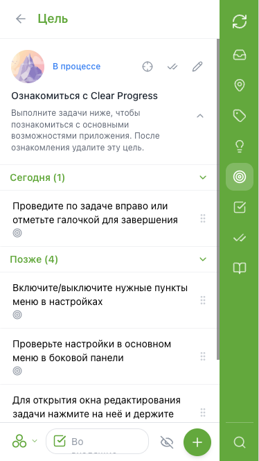
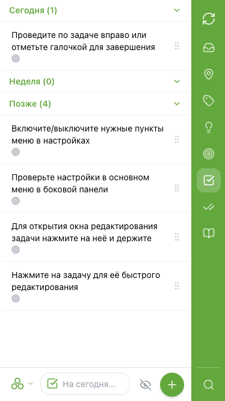
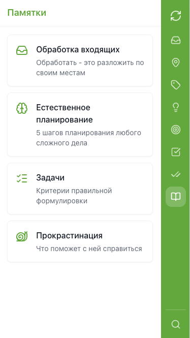
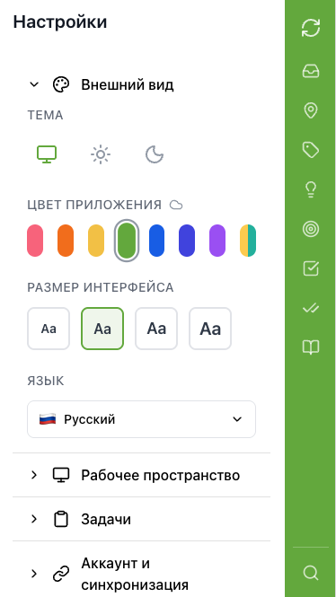

# Clear Progress

[](https://github.com/oinsio/clear-progress/actions/workflows/deploy.yml)
[](LICENSE)

[](README.md)
[](README.ru.md)

Персональное приложение для управления задачами, целями и идеями. Создано для GTD и Джедайских техник пустого инбокса. Client-first PWA, работающее офлайн — данные хранятся на устройстве, с опциональной синхронизацией через собственный сервер Supabase.

**[Открыть приложение](https://oinsio.github.io/clear-progress/)**

<p align="center">
  
</p>

## Содержание

- [Возможности](#возможности)
- [Настройка сервера (Supabase)](#настройка-сервера-supabase)
- [Технологии](#технологии)
- [Разработка](#разработка)
  - [Требования](#требования)
  - [Установка и запуск](#установка-и-запуск)
  - [Сборка](#сборка)
  - [Структура проекта](#структура-проекта)
  - [Тестирование](#тестирование)
  - [Документация](#документация)
- [Лицензия](#лицензия)

## Возможности

- **Коробочки задач** — Входящие, Сегодня, Неделя, Потом (организация в стиле GTD)
- **Цели** — отслеживание целей со статусами (планирование, в работе, пауза, завершено, отменено)
- **Идеи** — фиксация идей до того, как они станут задачами или целями
- **Контексты и категории** — организация задач по контексту (@Дом, @Офис) и сфере жизни (Работа, Семья)
- **Повторяющиеся задачи** — гибкие правила повторения с логикой пропуска
- **Чек-листы** — подзадачи внутри задач
- **Офлайн** — все данные хранятся локально в IndexedDB (Dexie), работает без интернета
- **Синхронизация** — опциональная синхронизация между устройствами через собственный Supabase-сервер
- **Два языка** — русский и английский интерфейс
- **PWA** — устанавливается на телефон и компьютер

<p>
  
  
  
  
</p>

## Настройка сервера (Supabase)

Приложение полноценно работает офлайн без сервера. Если вы хотите синхронизировать данные между устройствами, можно настроить бесплатный Supabase-сервер. Каждый пользователь создаёт свой сервер — ваши данные остаются под вашим контролем.

### Почему Supabase?

Supabase предлагает щедрый бесплатный тариф, которого более чем достаточно для личного использования. Вы получаете полноценную PostgreSQL-базу данных, Edge Functions для серверной логики, файловое хранилище и встроенную аутентификацию — всё бесплатно.

### Лимиты бесплатного тарифа

| Ресурс                         | Лимит                |
|--------------------------------|----------------------|
| База данных                    | 500 МБ               |
| Файловое хранилище             | 1 ГБ                 |
| Активных пользователей в месяц | 50 000               |
| Вызовов Edge Functions         | 500 000 / месяц      |
| Проекты                        | 2 бесплатных проекта |

> **Важно:** Бесплатные проекты автоматически ставятся на паузу после 1 недели неактивности. Возобновить можно в любой момент из Dashboard Supabase.

### Шаг 1: Создать аккаунт и проект в Supabase

1. Перейдите на [supabase.com/dashboard](https://supabase.com/dashboard) и зарегистрируйтесь (можно через GitHub)
2. Создайте организацию (любое название)
3. Создайте новый проект — придумайте имя, задайте пароль базы данных, выберите ближайший регион
4. Подождите, пока проект создастся (около 1 минуты)
5. Запишите **Project URL** и **Anon Key** — их можно найти в **Settings → API**

### Шаг 2: Включить OAuth-провайдер

Clear Progress поддерживает вход через OAuth (Google, GitHub и [другие провайдеры, поддерживаемые Supabase](https://supabase.com/docs/guides/auth/social-login)).

Рекомендуем использовать OAuth вместо входа по email, потому что бесплатный тариф ограничивает встроенный почтовый сервис до **2 писем в час**, что делает OTP-коды ненадёжными.

Чтобы включить провайдер:

1. В Supabase Dashboard перейдите в **Authentication → Providers**
2. Выберите провайдер (например, Google или GitHub) и следуйте инструкции:
   - [Настройка Google](https://supabase.com/docs/guides/auth/social-login/auth-google)
   - [Настройка GitHub](https://supabase.com/docs/guides/auth/social-login/auth-github)
   - [Все провайдеры](https://supabase.com/docs/guides/auth/social-login)
3. Укажите **Site URL**: `https://oinsio.github.io/clear-progress/` (или ваш домен, если хостите клиент самостоятельно)
4. Добавьте тот же URL в **Redirect URLs**

### Шаг 3: Развернуть бэкенд

Бэкенд состоит из таблиц базы данных, RLS-политик и Edge Functions. Скрипт деплоя автоматизирует всё.

**Необходимо:**
- [Node.js](https://nodejs.org/) >= 20 и [pnpm](https://pnpm.io/) >= 9
- [Supabase CLI](https://supabase.com/docs/guides/cli) — установить через `npm install -g supabase`

**Деплой:**

```bash
# Клонировать репозиторий
git clone https://github.com/oinsio/clear-progress.git
cd clear-progress

# Установить зависимости
pnpm install

# Войти в Supabase CLI
supabase login

# Настроить окружение
cd packages/adapter-supabase
cp .env.prod .env.prod.local
# Отредактируйте .env.prod.local — заполните SUPABASE_URL, SUPABASE_ANON_KEY,
# SUPABASE_PROJECT_REF и SUPABASE_ACCESS_TOKEN
# (найдите их в Supabase Dashboard → Settings → API)

# Развернуть (применяет миграции, деплоит Edge Functions, создаёт бакет хранилища)
bash scripts/deploy.sh prod
```

Подробнее — в [packages/adapter-supabase/README.md](packages/adapter-supabase/README.md).

### Шаг 4: Подключить приложение

1. Откройте [Clear Progress](https://oinsio.github.io/clear-progress/)
2. Перейдите в **Настройки** (значок шестерёнки) → раздел **Сервер**
3. Нажмите **Supabase**
4. Введите **Project URL** (например, `https://yourproject.supabase.co` или просто `yourproject`) и **Anon Key**
5. Нажмите **Connect**
6. Войдите через OAuth-провайдер (например, Google или GitHub)

Данные будут автоматически синхронизироваться между устройствами.

## Технологии

| Слой                | Технология                                                                |
|---------------------|---------------------------------------------------------------------------|
| Фронтенд            | React, TypeScript, Vite, Tailwind CSS                                     |
| Локальное хранилище | Dexie (IndexedDB)                                                         |
| Бэкенд              | Supabase — Edge Functions (Deno), PostgreSQL, Row Level Security, Storage |
| Интернационализация | i18next                                                                   |
| Пакетный менеджер   | pnpm (монорепозиторий)                                                    |

## Разработка

### Требования

- [Node.js](https://nodejs.org/) >= 20
- [pnpm](https://pnpm.io/) >= 9

### Установка и запуск

```bash
git clone https://github.com/oinsio/clear-progress.git
cd clear-progress
pnpm install
pnpm dev
```

### Сборка

```bash
pnpm build
```

### Структура проекта

```
packages/
  client/             — React PWA (Vite + Tailwind + Dexie)
  contract/           — Общие интерфейсы (порт SyncAdapter)
  adapter-supabase/   — Supabase-бэкенд (Edge Functions + миграции)
  adapter-inmemory/   — In-memory адаптер (для тестов)
  integration/        — Интеграционные тесты
docs/
  architecture/       — Модель данных, протокол синхронизации, компоненты
  adr/                — Архитектурные решения (ADR)
  guides/             — Гайд по i18n, Temporal API
  contributing/       — Как добавить новый адаптер
```

### Тестирование

| Тип                      | Инструмент                  | Команда                                  |
|--------------------------|-----------------------------|------------------------------------------|
| Юнит-тесты               | Vitest                      | `pnpm test`                              |
| BDD юнит                 | vitest-cucumber             | `pnpm test` (включены)                   |
| BDD E2E                  | playwright-bdd              | `pnpm --filter client test:bdd`          |
| Мутационное тестирование | Stryker                     | `pnpm --filter client test:mutation`     |
| Интеграционные           | Playwright + Testcontainers | `pnpm --filter integration test`         |

Интеграционные тесты поднимают полный стек Supabase локально через Docker Compose (Testcontainers). Они проверяют сквозные сценарии синхронизации — push/pull, конфликты между устройствами, повторяющиеся задачи, вложения и другое. Docker должен быть запущен перед стартом тестов.

### Документация

- [Настройка Supabase-адаптера](packages/adapter-supabase/README.md)
- [Как добавить новый адаптер бэкенда](docs/contributing/how-to-add-adapter.md)
- [Модель данных и протокол синхронизации](docs/architecture/data-model-and-sync.md)
- [Архитектурные решения (ADR)](docs/adr/)
- [Спецификации продукта (OpenSpec)](openspec/specs/)

## Лицензия

Бесплатно для личного и некоммерческого использования. Для коммерческого использования необходима отдельная лицензия — см. [LICENSE-COMMERCIAL.md](LICENSE-COMMERCIAL.md).

- [LICENSE](LICENSE) — полный текст лицензии
- [NOTICE](NOTICE) — копирайт и раскрытие использования ИИ
- [CLA.md](CLA.md) — лицензионное соглашение для контрибьюторов
- [CONTRIBUTING.md](CONTRIBUTING.md) — как внести вклад
