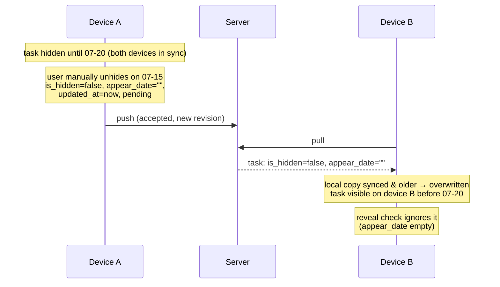

# Delta: manual-task-hiding

## MODIFIED Requirements

### Requirement: Hidden tasks auto-reveal on appear date
Implements FR1 of fix-stale-sync-overwrites (was: FR7, FR8 of hide-tasks).

The system SHALL automatically set `is_hidden = false` when `appear_date <= logicalDate`. The task SHALL remain in its original box. Auto-reveal SHALL set `syncStatus = "pending"` but SHALL NOT modify `updated_at` — it is a system-derived transition, not a user edit; the timestamp stays at the last real user edit so a stale device cannot win last-write-wins against newer edits from another device.

#### Scenario: Task revealed when appear date arrives
- **WHEN** the logical date reaches or passes the task's `appear_date`
- **THEN** `HiddenTaskService.revealHiddenTasks()` sets `is_hidden = false`
- **AND** the task remains in its original box
- **AND** the task's `updated_at` is unchanged and `syncStatus` is `"pending"`

## ADDED Requirements

### Requirement: Manual unhide before appear date is a synced user edit
Implements FR2 of fix-stale-sync-overwrites.

When the user manually unhides a manually hidden task before its `appear_date`, the system SHALL treat it as a regular user edit: set `is_hidden = false`, clear `appear_date`, refresh `updated_at`, and set `syncStatus = "pending"`. The manual unhide SHALL propagate to other devices via ordinary push/pull and SHALL win last-write-wins against any older state of the record. Manual hide (setting `is_hidden = true` with an `appear_date`) SHALL behave symmetrically as a user edit. This applies to non-recurring tasks only — recurring tasks expose no manual hide/unhide controls (see "Hide action excluded for recurring tasks"); hidden recurring copies are governed solely by system auto-reveal.

#### Scenario: Manual unhide propagates to another device
- **GIVEN** a task hidden until "2026-07-20" synced on devices A and B
- **WHEN** the user manually unhides it on device A on "2026-07-15" and both devices sync
- **THEN** the task is visible on device B with `appear_date = ""` before "2026-07-20"

#### Scenario: Manual unhide refreshes the timestamp
- **GIVEN** a hidden task with `updated_at = t1`
- **WHEN** the user manually unhides it
- **THEN** `is_hidden = false`, `appear_date = ""`, `updated_at > t1`, `syncStatus = "pending"`

#### Scenario: Manual hide propagates to another device
- **GIVEN** a visible task synced on devices A and B
- **WHEN** the user hides it until "2026-08-01" on device A and both devices sync
- **THEN** the task is hidden on device B with `appear_date = "2026-08-01"`
