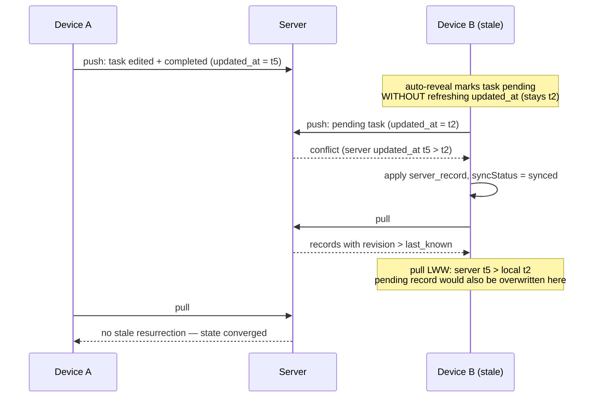

# Delta: sync-protocol

## MODIFIED Requirements

### Requirement: Pull protects local dirty records
Implements FR5 of fix-stale-sync-overwrites.

When applying server records from pull, the client SHALL compare timestamps for records that have `syncStatus = "pending"`: the server record SHALL overwrite the local pending record only when the server record's `updated_at` is strictly newer than the local `updated_at` (last-write-wins, mirroring push conflict resolution). When the local `updated_at` is equal or newer, the local pending record SHALL be preserved and pushed in the next sync. Records with `syncStatus = "synced"` or `"rejected"` SHALL be overwritten by the server version as before. Every overwrite of a pending record SHALL be logged with entity type, record id, and both timestamps.

Multi-device convergence for the stale-device scenario this rule fixes (device B held a stale pending copy freshened by a system mutation):

#### Scenario: Clean local record is overwritten by server
- **WHEN** pull returns a record that exists locally with `syncStatus = "synced"`
- **THEN** local record is overwritten with server version

#### Scenario: Pending local record loses to strictly newer server record
- **GIVEN** a local record with `syncStatus = "pending"` and `updated_at = "2026-07-01T10:00:00.000Z"`
- **WHEN** pull returns the same record with `updated_at = "2026-07-02T10:00:00.000Z"`
- **THEN** local record is overwritten with the server version and `syncStatus` becomes `"synced"`
- **AND** the overwrite is logged with entity type, id, and both timestamps

#### Scenario: Pending local record with equal timestamp is preserved
- **GIVEN** a local record with `syncStatus = "pending"` and `updated_at = "2026-07-01T10:00:00.000Z"`
- **WHEN** pull returns the same record with `updated_at = "2026-07-01T10:00:00.000Z"`
- **THEN** local record is NOT overwritten (will be pushed in next sync)

#### Scenario: Pending local record with newer timestamp is preserved
- **GIVEN** a local record with `syncStatus = "pending"` and `updated_at = "2026-07-03T10:00:00.000Z"`
- **WHEN** pull returns the same record with `updated_at = "2026-07-02T10:00:00.000Z"`
- **THEN** local record is NOT overwritten (will be pushed in next sync)

#### Scenario: New server record is inserted
- **WHEN** pull returns a record that does not exist locally
- **THEN** record is inserted into IndexedDB
