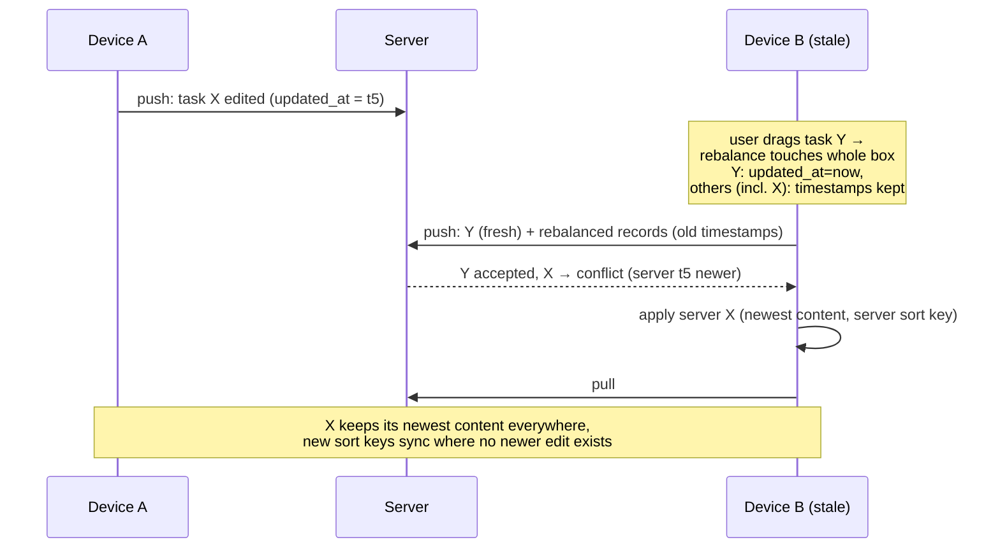

# Delta: tasks

## MODIFIED Requirements

### Requirement: Lazy rebalancing when key exceeds threshold
Implements FR4 of fix-stale-sync-overwrites (was: FR9 of fractional-sort-order).

When a newly generated sort_order key exceeds 10 characters, the system MUST rebalance all tasks in the same box with evenly distributed keys preserving current display order. Rebalanced tasks SHALL be marked `syncStatus = "pending"` but their `updated_at` SHALL NOT be modified — rebalancing is a system-derived mutation, and refreshing the timestamps would let a stale device overwrite newer content of every task in the box via whole-record last-write-wins. Only the task the user actually dragged SHALL get a refreshed `updated_at` (in `reorderTasks`).

Rebalance on a stale device no longer clobbers newer content of untouched tasks:

#### Scenario: Rebalancing triggered by long key
- **GIVEN** today box has tasks with deeply nested sort_order keys
- **WHEN** a drag-drop produces a key longer than 10 characters
- **THEN** all tasks in today box get fresh evenly distributed keys
- **AND** display order is preserved
- **AND** all rebalanced tasks are marked syncStatus="pending"
- **AND** `updated_at` of every task except the dragged one is unchanged

#### Scenario: Rebalancing not triggered for short keys
- **GIVEN** today box has tasks with short sort_order keys
- **WHEN** a drag-drop produces a key of 4 characters
- **THEN** only the dragged task is updated

#### Scenario: Rebalance on a stale device does not clobber newer content
- **GIVEN** device B holds task X last synced at t2, while the server has X edited at t5 (t5 > t2)
- **WHEN** device B rebalances the box (X gets a new sort key, `updated_at` stays t2) and pushes
- **THEN** the server responds `conflict` for X and device B applies the server version with the newest content
