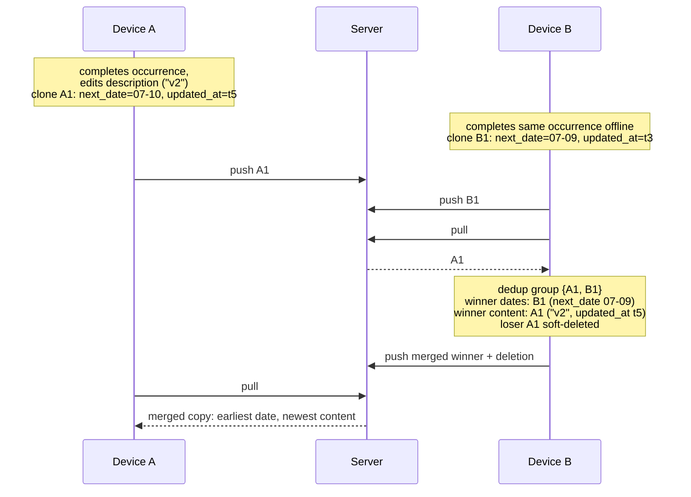
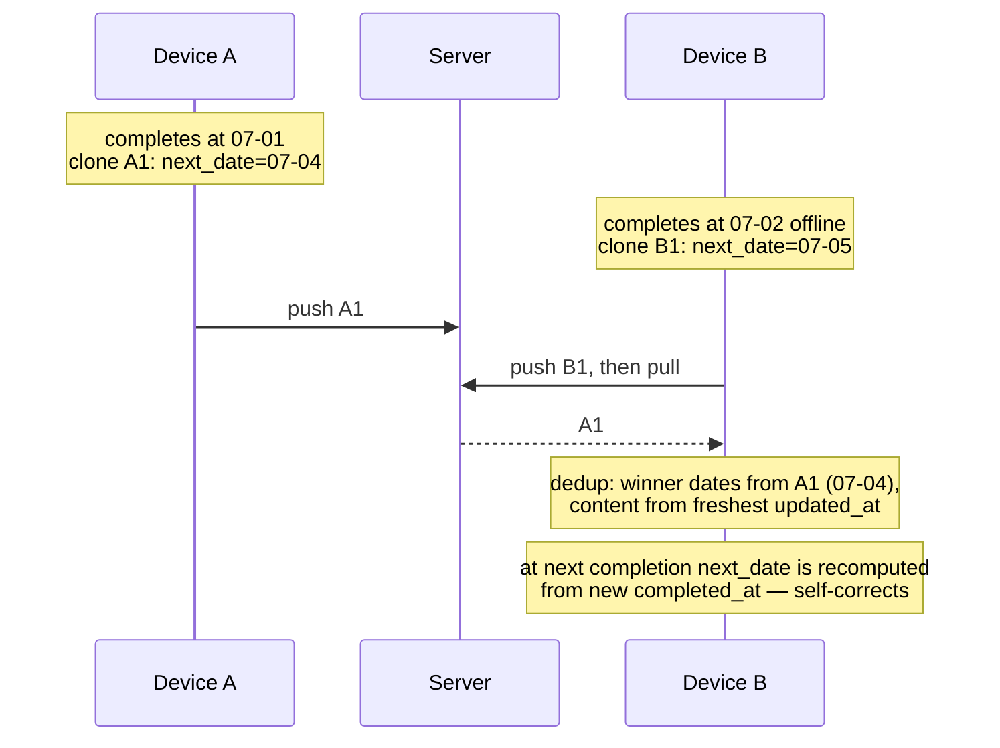

# Delta: repeating-tasks

## MODIFIED Requirements

### Requirement: System reveals hidden tasks when appear date arrives
# implements FR1 of fix-stale-sync-overwrites (was: FR11 of repeating-tasks-specs, FR4 of day-boundary)

System MUST reveal hidden tasks (set is_hidden=false, syncStatus="pending") when appear_date <= logical date. Reveal MUST NOT modify `updated_at` — auto-reveal is a system-derived transition, not a user edit, and the record's timestamp SHALL remain that of the last real user edit so that last-write-wins conflict resolution cannot prefer a stale record over newer edits from another device. Reveal MUST be triggered on: app mount, day boundary transition (instead of midnight), sync_complete event, return from background (visibility change), and day boundary setting change.

#### Scenario: Reveal tasks whose appear_date has arrived
- **GIVEN** hidden task with appear_date "2026-01-15" and logical date is "2026-01-15"
- **WHEN** system runs reveal check
- **THEN** task has is_hidden false, syncStatus "pending"
- **AND** the task's `updated_at` is unchanged

#### Scenario: Do not reveal tasks whose appear_date is future
- **GIVEN** hidden task with appear_date "2026-01-20" and logical date is "2026-01-15"
- **WHEN** system runs reveal check
- **THEN** task remains hidden

#### Scenario: Reveal triggered on app mount
- **WHEN** app mounts
- **THEN** system runs reveal check with current logical date

#### Scenario: Reveal triggered at day boundary
- **WHEN** clock passes the configured day boundary time
- **THEN** system runs reveal check with new logical date

#### Scenario: Reveal of a stale copy loses push conflict to newer server state
- **GIVEN** device B holds a recurring copy last edited at t2 that was completed on device A at t5 (t5 > t2)
- **WHEN** device B auto-reveals the copy and pushes it with `updated_at = t2`
- **THEN** the server responds `conflict` and device B applies the server record (completed, newest content)

### Requirement: System deduplicates recurring copies after pull
# implements FR3, FR6 of fix-stale-sync-overwrites (was: FR1, FR2 of dedup-recurring-after-pull)

After applying a pull batch, the system SHALL detect duplicate recurring copies — multiple non-completed, non-deleted tasks sharing the same `original_task_id`. Among duplicates, the system SHALL keep the winner by earliest `next_date`, tiebreak by lexicographically smallest `id`. Losers SHALL be soft-deleted with `syncStatus: "pending"`.

The winner SHALL be merged, not kept verbatim:

- Schedule fields `next_date` and `appear_date` SHALL be taken **as a pair** from the copy with the earliest `next_date` (they are coupled via `advance_days`; mixing copies would corrupt reveal timing).
- Content fields (`name`, `description`, `goal_id`, `context_id`, `category_id`, `box`) SHALL be taken from the copy with the freshest `updated_at`.
- The merged winner's `updated_at` SHALL equal the freshest copy's `updated_at`; deduplication SHALL NOT refresh it to the current time.
- When `repeat_rule` differs between copies, the copy with the freshest `updated_at` SHALL win wholesale (all fields including `next_date` and `appear_date`), because a rule change recomputes its dates under the new rule.

Merge semantics apply identically to both recurring models (`fixed` and `after_completion`); the earliest-`next_date` winner rule for schedules is unchanged, and for `after_completion` any suboptimal winner self-corrects at the next completion because its next date derives only from the new `completed_at`.

Two-device double completion of the same occurrence (fixed schedule):

Two-device double completion (`after_completion`, delay 3 days):

#### Scenario: Two duplicates with same next_date — tiebreak by id
- **GIVEN** task Copy-A (id="aaa...", original_task_id="root", next_date="2026-07-01") and Copy-B (id="bbb...", original_task_id="root", next_date="2026-07-01"), both non-completed, non-deleted
- **WHEN** deduplication runs after pull
- **THEN** Copy-A is kept (smaller id) and Copy-B is soft-deleted

#### Scenario: Two duplicates with different next_date — earlier wins
- **GIVEN** task Copy-A (original_task_id="root", next_date="2026-07-05") and Copy-B (original_task_id="root", next_date="2026-07-01"), both non-completed, non-deleted
- **WHEN** deduplication runs after pull
- **THEN** Copy-B is kept (earlier next_date) and Copy-A is soft-deleted

#### Scenario: Winner takes content from the freshest copy
- **GIVEN** Copy-A (next_date="2026-07-05", description="v2", updated_at="2026-07-02T10:00:00.000Z") and Copy-B (next_date="2026-07-01", description="v1", updated_at="2026-07-01T10:00:00.000Z"), same original_task_id
- **WHEN** deduplication runs after pull
- **THEN** the kept record has next_date "2026-07-01", appear_date from Copy-B, description "v2", and updated_at "2026-07-02T10:00:00.000Z"

#### Scenario: Dates always move as a pair
- **GIVEN** duplicates where the earliest-next_date copy has appear_date derived from its own next_date
- **WHEN** deduplication merges the winner
- **THEN** next_date and appear_date both come from the earliest-next_date copy (never mixed across copies)

#### Scenario: Differing repeat_rule — freshest copy wins wholesale
- **GIVEN** Copy-A (repeat_rule=daily-1, next_date="2026-07-01", updated_at older) and Copy-B (repeat_rule=weekly-Mon, next_date="2026-07-06", updated_at newer), same original_task_id
- **WHEN** deduplication runs after pull
- **THEN** the kept record equals Copy-B in all fields including next_date and appear_date

#### Scenario: No duplicates — no action
- **GIVEN** only one non-completed, non-deleted task per original_task_id
- **WHEN** deduplication runs after pull
- **THEN** no tasks are modified

#### Scenario: Completed copies are excluded from dedup
- **GIVEN** Copy-A (original_task_id="root", is_completed=true) and Copy-B (original_task_id="root", is_completed=false)
- **WHEN** deduplication runs after pull
- **THEN** no deduplication occurs (only one non-completed copy exists)
