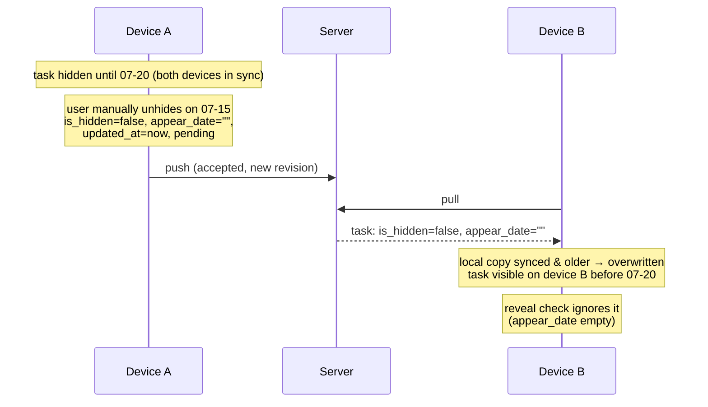

# Capability: Manual Task Hiding

## Purpose

Allows users to temporarily hide non-recurring tasks until a future date. Hidden tasks disappear from active lists but auto-reveal when the appear date arrives. Provides hide/unhide controls in quick actions and detail panel.

## Requirements

### Requirement: User can hide a non-recurring task until a future date
The system SHALL allow users to hide a task that has no `repeat_rule` by setting `is_hidden = true` and a mandatory `appear_date` that is strictly after today. The task SHALL disappear from active lists (unless the eye toggle is on). Implements FR1 of hide-tasks.

#### Scenario: Hide a task with a future appear date
- **WHEN** user selects a future date and confirms hiding a non-recurring task
- **THEN** the task's `is_hidden` is set to `true` and `appear_date` is set to the selected date
- **AND** the task disappears from active task lists

#### Scenario: Cannot hide without selecting a date
- **WHEN** user opens the hide panel but has not selected a date
- **THEN** the "Hide" confirmation button is disabled

#### Scenario: Cannot hide with a past or today's date
- **WHEN** user attempts to select today's date or a past date
- **THEN** the date input rejects the selection (native `min` constraint) and the "Hide" button remains disabled

### Requirement: User can unhide a hidden task immediately
The system SHALL allow users to unhide a manually hidden task, setting `is_hidden = false` and `appear_date = ""`. The task SHALL immediately appear in its original box. Implements FR2 of hide-tasks.

#### Scenario: Unhide a hidden task via quick actions
- **WHEN** user clicks the Eye icon on a hidden task in TaskQuickActions
- **THEN** the task's `is_hidden` is set to `false` and `appear_date` is cleared to `""`
- **AND** the task appears in its original box immediately

#### Scenario: Unhide a hidden task via detail panel
- **WHEN** user clicks "Unhide" in the TaskDetailPanel hide section
- **THEN** the task's `is_hidden` is set to `false` and `appear_date` is cleared to `""`

### Requirement: Hide action available in TaskQuickActions
The system SHALL show a hide/unhide button in the TaskQuickActions icon row for non-recurring tasks. For non-hidden tasks, the button shows `EyeOff` icon and opens a date picker panel. For hidden tasks, the button shows `Eye` icon and unhides immediately on click. Implements FR3 of hide-tasks.

#### Scenario: Non-hidden non-recurring task shows EyeOff button
- **WHEN** user expands a non-recurring, non-hidden task's quick actions
- **THEN** an `EyeOff` icon button is displayed in the action row

#### Scenario: Hidden task shows Eye button
- **WHEN** user expands a hidden task's quick actions (via eye toggle)
- **THEN** an `Eye` icon button is displayed in the action row

#### Scenario: Clicking EyeOff opens date picker panel
- **WHEN** user clicks the `EyeOff` button on a non-hidden task
- **THEN** a date picker panel appears below the action row

### Requirement: Hide section available in TaskDetailPanel
The system SHALL show a "Hide until" row in the TaskDetailPanel details tab for non-recurring tasks. Clicking it opens a hide/unhide panel. Implements FR4 of hide-tasks.

#### Scenario: Non-recurring task shows hide row in detail panel
- **WHEN** user opens TaskDetailPanel for a non-recurring task
- **THEN** a "Hide until" row is displayed after the repeat rule row

#### Scenario: Hidden task shows appear date in detail panel
- **WHEN** user opens TaskDetailPanel for a hidden task
- **THEN** the "Hide until" row displays the formatted appear date

### Requirement: Hide action excluded for recurring tasks
The system SHALL NOT show hide/unhide controls for tasks with a non-empty `repeat_rule`. Implements FR5 of hide-tasks.

#### Scenario: Recurring task has no hide button in quick actions
- **WHEN** user expands a recurring task's quick actions
- **THEN** no hide/unhide button is displayed

#### Scenario: Recurring task has no hide row in detail panel
- **WHEN** user opens TaskDetailPanel for a recurring task
- **THEN** no "Hide until" row is displayed

### Requirement: Hidden tasks auto-reveal on appear date
The system SHALL automatically set `is_hidden = false` when `appear_date <= logicalDate`. The task SHALL remain in its original box. Auto-reveal SHALL set `syncStatus = "pending"` but SHALL NOT modify `updated_at` — it is a system-derived transition, not a user edit; the timestamp stays at the last real user edit so a stale device cannot win last-write-wins against newer edits from another device. Implements FR1 of fix-stale-sync-overwrites (was: FR7, FR8 of hide-tasks).

#### Scenario: Task revealed when appear date arrives
- **WHEN** the logical date reaches or passes the task's `appear_date`
- **THEN** `HiddenTaskService.revealHiddenTasks()` sets `is_hidden = false`
- **AND** the task remains in its original box
- **AND** the task's `updated_at` is unchanged and `syncStatus` is `"pending"`

### Requirement: Manual unhide before appear date is a synced user edit
Implements FR2 of fix-stale-sync-overwrites.

When the user manually unhides a manually hidden task before its `appear_date`, the system SHALL treat it as a regular user edit: set `is_hidden = false`, clear `appear_date`, refresh `updated_at`, and set `syncStatus = "pending"`. The manual unhide SHALL propagate to other devices via ordinary push/pull and SHALL win last-write-wins against any older state of the record. Manual hide (setting `is_hidden = true` with an `appear_date`) SHALL behave symmetrically as a user edit. This applies to non-recurring tasks only — recurring tasks expose no manual hide/unhide controls (see "Hide action excluded for recurring tasks"); hidden recurring copies are governed solely by system auto-reveal.

#### Scenario: Manual unhide propagates to another device
- **GIVEN** a task hidden until "2026-07-20" synced on devices A and B
- **WHEN** the user manually unhides it on device A on "2026-07-15" and both devices sync
- **THEN** the task is visible on device B with `appear_date = ""` before "2026-07-20"

#### Scenario: Manual unhide refreshes the timestamp
- **GIVEN** a hidden task with `updated_at = t1`
- **WHEN** the user manually unhides it
- **THEN** `is_hidden = false`, `appear_date = ""`, `updated_at > t1`, `syncStatus = "pending"`

#### Scenario: Manual hide propagates to another device
- **GIVEN** a visible task synced on devices A and B
- **WHEN** the user hides it until "2026-08-01" on device A and both devices sync
- **THEN** the task is hidden on device B with `appear_date = "2026-08-01"`
