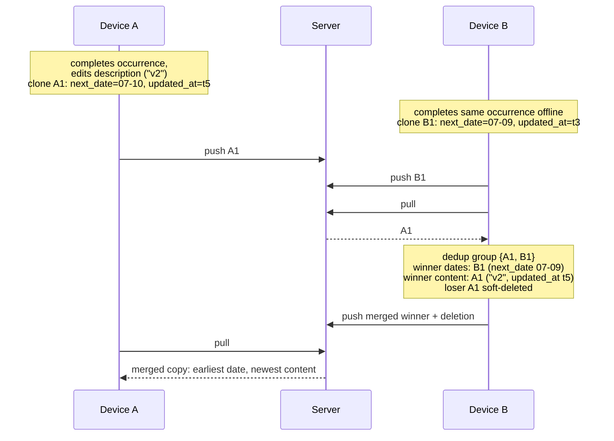
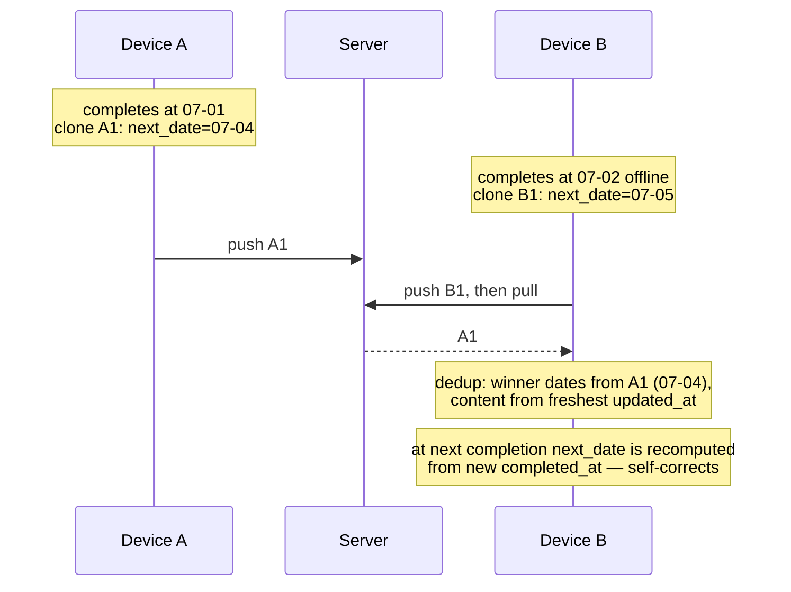

# Capability: Repeating Tasks

## Purpose

Recurring task lifecycle: parsing repeat rules, calculating next occurrence dates with skip logic, creating recurring copies on completion, managing hidden tasks with advance days, and adapting to timezone changes. Ensures only one future occurrence exists at a time (no backlog flood).

## ADDED Requirements

### Requirement: System can parse a repeat rule from JSON
# implements FR1 of repeating-tasks-specs

System MUST parse a JSON string into a RepeatRule object using Zod validation. Empty string or invalid JSON MUST return null.

#### Scenario: Parse valid fixed daily rule
- **GIVEN** JSON string `{"type":"fixed","frequency":"daily","interval":1,"target_box":"today","advance_days":0}`
- **WHEN** system parses the repeat rule
- **THEN** result is a RepeatRule with type "fixed", frequency "daily", interval 1

#### Scenario: Parse valid after_completion rule
- **GIVEN** JSON string `{"type":"after_completion","delay_days":3,"target_box":"inbox","advance_days":0}`
- **WHEN** system parses the repeat rule
- **THEN** result is a RepeatRule with type "after_completion", delay_days 3

#### Scenario: Parse empty string returns null
- **GIVEN** an empty string ""
- **WHEN** system parses the repeat rule
- **THEN** result is null

#### Scenario: Parse invalid JSON returns null
- **GIVEN** JSON string `{not valid}`
- **WHEN** system parses the repeat rule
- **THEN** result is null

#### Scenario: Parse JSON failing Zod validation returns null
- **GIVEN** JSON string `{"type":"unknown_type"}`
- **WHEN** system parses the repeat rule
- **THEN** result is null

### Requirement: System can serialize a repeat rule and format a label
# implements FR2 of repeating-tasks-specs

System MUST serialize a RepeatRule to JSON string. System MUST format a human-readable label using i18n translations for all frequency types.

#### Scenario: Serialize a fixed daily rule
- **GIVEN** a RepeatRule with type "fixed", frequency "daily", interval 2
- **WHEN** system serializes the rule
- **THEN** result is a valid JSON string containing the rule fields

#### Scenario: Format label for daily with interval 1
- **GIVEN** a RepeatRule with type "fixed", frequency "daily", interval 1
- **WHEN** system formats the label
- **THEN** result uses i18n key "repeat.everyNDays" with count 1

#### Scenario: Format label for weekly with weekdays
- **GIVEN** a RepeatRule with type "fixed", frequency "weekly", interval 1, weekdays [1, 3, 5]
- **WHEN** system formats the label
- **THEN** result includes translated weekday names

#### Scenario: Format label for after_completion
- **GIVEN** a RepeatRule with type "after_completion", delay_days 5
- **WHEN** system formats the label
- **THEN** result uses i18n key "repeat.afterCompletion" with count 5

### Requirement: System calculates next date for fixed daily frequency
# implements FR3 of repeating-tasks-specs, FR1, FR2 of fix-recurring-skip-logic, FR1, FR2, FR3 of align-daily-to-calendar-rhythm

System MUST calculate `next_date` for daily frequency by advancing from `previousNextDate` by `interval` days (calendar-aligned, Model B). Early completion MUST preserve the scheduled date. Skip logic MUST apply when the candidate is in the past — skip to the nearest future date aligned to the interval grid, strictly `> today`.

This aligns daily with weekly/monthly/yearly: all fixed frequencies use schedule-based computation. The `after_completion` type remains the only "from today" model.

#### Scenario: Daily interval 1 normal completion
- **WHEN** previous next_date is "2026-07-01" and today is "2026-07-01" and completed_at date is "2026-07-01"
- **THEN** system calculates next date with daily interval 1 as "2026-07-02"

#### Scenario: Daily interval 1 early completion preserves schedule
- **WHEN** previous next_date is "2026-07-02" and today is "2026-07-01" and completed_at date is "2026-07-01"
- **THEN** system calculates next date with daily interval 1 as "2026-07-02" (schedule preserved)

#### Scenario: Daily interval 1 late by 1 day skips to future
- **WHEN** previous next_date is "2026-07-01" and today is "2026-07-02" and completed_at date is "2026-07-02"
- **THEN** system calculates next date with daily interval 1 as "2026-07-03" (07-02 is today, skip to 07-03)

#### Scenario: Daily interval 1 long inactivity skips to tomorrow
- **WHEN** previous next_date is "2026-07-01" and today is "2026-07-15" and completed_at date is "2026-07-15"
- **THEN** system calculates next date with daily interval 1 as "2026-07-16"

#### Scenario: Daily interval 3 normal completion
- **WHEN** previous next_date is "2026-07-01" and today is "2026-07-01" and completed_at date is "2026-07-01"
- **THEN** system calculates next date with daily interval 3 as "2026-07-04"

#### Scenario: Daily interval 3 early completion preserves schedule
- **WHEN** previous next_date is "2026-07-04" and today is "2026-07-02" and completed_at date is "2026-07-02"
- **THEN** system calculates next date with daily interval 3 as "2026-07-04" (schedule preserved)

#### Scenario: Daily interval 3 late but candidate still in future
- **WHEN** previous next_date is "2026-07-01" and today is "2026-07-03" and completed_at date is "2026-07-03"
- **THEN** system calculates next date with daily interval 3 as "2026-07-04" (candidate > today)

#### Scenario: Daily interval 3 long inactivity skips by grid
- **WHEN** previous next_date is "2026-07-01" and today is "2026-07-15" and completed_at date is "2026-07-15"
- **THEN** system calculates next date with daily interval 3 as "2026-07-16" (grid: 01,04,07,10,13,16 — 16 > today)

#### Scenario: Daily interval 3 long inactivity candidate equals today
- **WHEN** previous next_date is "2026-07-01" and today is "2026-07-16" and completed_at date is "2026-07-16"
- **THEN** system calculates next date with daily interval 3 as "2026-07-19" (grid: 01,04,...,16 — 16 <= today, next is 19)

#### Scenario: Daily nearest-match on rule creation with interval 1
- **WHEN** user creates a daily rule with interval 1 and today is "2026-07-01"
- **THEN** system calculates next date as "2026-07-02" (today + interval)

#### Scenario: Daily nearest-match on rule creation with interval 3
- **WHEN** user creates a daily rule with interval 3 and today is "2026-07-01"
- **THEN** system calculates next date as "2026-07-04" (today + interval)

#### Scenario: Daily nearest-match on rule change resets rhythm
- **WHEN** user changes daily interval from 1 to 2 and today is "2026-07-03"
- **THEN** system calculates next date as "2026-07-05" (today + new interval, clean restart)

### Requirement: System calculates next date for fixed weekly frequency
# implements FR4 of repeating-tasks-specs, FR1, FR2, FR5 of unify-next-date-calculation

System MUST calculate `next_date` for weekly frequency using two modes:

**Mode `nearest-match`** (first creation, rule change): System SHALL find the earliest weekday from the weekdays list that is strictly after today, scanning up to 7 days from tomorrow. The `interval` parameter SHALL NOT affect the first jump — it only defines the rhythm for subsequent completions. This ensures consistent behavior between first creation and rule change paths.

**Mode `from-schedule`** (subsequent completions): System SHALL compute `nextDay = previousNextDate + 1`, find the next matching weekday respecting the interval (every N weeks). Skip logic SHALL align to the nearest future week period if the candidate is in the past. Weekdays use ISO 8601 (1=Monday, 7=Sunday). The two-step algorithm (current week first, then advance by interval) is unchanged.

The dead branch `!previousNextDate` in `calculateNextDateWeekly` SHALL be removed — it is unreachable through the public API.

#### Scenario: Weekly single weekday
- **GIVEN** previous next_date is Monday "2026-01-05" and weekdays [1] (Monday) and today is "2026-01-05"
- **WHEN** system calculates next date with weekly interval 1
- **THEN** result is "2026-01-12" (next Monday)

#### Scenario: Weekly multiple weekdays
- **GIVEN** previous next_date is Monday "2026-01-05" and weekdays [1, 3, 5] (Mon, Wed, Fri) and today is "2026-01-05"
- **WHEN** system calculates next date with weekly interval 1
- **THEN** result is "2026-01-07" (next Wednesday)

#### Scenario: Weekly interval 2
- **GIVEN** previous next_date is Monday "2026-01-05" and weekdays [1] (Monday) and today is "2026-01-05"
- **WHEN** system calculates next date with weekly interval 2
- **THEN** result is "2026-01-19" (Monday two weeks later)

#### Scenario: Weekly skip logic skips missed weeks
- **GIVEN** previous next_date is "2026-01-06" and weekdays [1] (Monday) and today is "2026-02-01"
- **WHEN** system calculates next date with weekly interval 1
- **THEN** result is the nearest Monday on or after "2026-02-01"

#### Scenario: Weekly early completion — next Monday still in future
- **WHEN** previous next_date is "2026-07-06" (Monday) and weekdays [1] and today is "2026-07-04" (Saturday)
- **THEN** system calculates next date with weekly interval 1 as "2026-07-06" (the scheduled Monday, still in future — task for current period not yet due)

#### Scenario: Weekly early completion — biweekly rhythm preserved
- **WHEN** previous next_date is "2026-07-06" (Monday) and weekdays [1] and today is "2026-07-04" (Saturday)
- **THEN** system calculates next date with weekly interval 2 as "2026-07-06" (same as interval 1 — the next Monday from prev is still in the future, no interval skip needed)

#### Scenario: Weekly nearest-match with interval 1
- **WHEN** mode is `nearest-match`, today is "2026-05-31" (Sunday), weekdays=[1] (Monday), interval=1
- **THEN** result is "2026-06-01" (nearest Monday)

#### Scenario: Weekly nearest-match with interval 2 finds nearest day (bug fix)
- **WHEN** mode is `nearest-match`, today is "2026-05-30" (Saturday), weekdays=[1] (Monday), interval=2
- **THEN** result is "2026-06-01" (nearest Monday, NOT 2026-06-08)

#### Scenario: Weekly nearest-match same result as rule change
- **WHEN** mode is `nearest-match`, today is "2026-06-08" (Monday), weekdays=[5] (Friday), interval=3
- **THEN** result is "2026-06-12" (nearest Friday, interval ignored for first jump)

#### Scenario: Weekly from-schedule with interval 2 single weekday
- **WHEN** mode is `from-schedule`, previousNextDate is "2026-06-01" (Monday), weekdays=[1], interval=2, today is "2026-06-01"
- **THEN** result is "2026-06-15" (Monday two weeks later — interval respected)

#### Scenario: Weekly from-schedule with interval 2 multiple weekdays same week
- **WHEN** mode is `from-schedule`, previousNextDate is "2026-06-01" (Monday), weekdays=[1,3], interval=2, today is "2026-06-01"
- **THEN** result is "2026-06-03" (Wednesday of same week — no interval skip within active week)

#### Scenario: Weekly from-schedule skip logic
- **WHEN** mode is `from-schedule`, previousNextDate is "2026-01-06", weekdays=[1], interval=1, today is "2026-02-01"
- **THEN** result is the nearest Monday on or after "2026-02-01"

### Requirement: Weekly recurrence with multiple weekdays respects interval as week-level skip
# implements FR5 of repeating-tasks-specs

System MUST treat `interval` in weekly recurrence as the number of weeks between active periods, not as a gap between individual weekday occurrences. When `weekdays` contains multiple days, all matching days within the same ISO week SHALL fire before advancing to the next active week.

The algorithm for `calculateNextDateWeekly` SHALL be:
1. Compute `nextDay = previousNextDate + 1 day`
2. Find all weekdays in the same ISO week as `nextDay` that are >= `nextDay`
3. If any matching weekday exists in the current week, return the earliest one (no interval skip)
4. If no matching weekday remains in the current week, advance to Monday of the next week, then skip `(interval - 1) * 7` days, and return the first matching weekday

#### Scenario: Biweekly Mon+Wed fires both days in active week
- **WHEN** rule is weekly, interval=2, weekdays=[1,3], previousNextDate="2026-06-01" (Monday)
- **THEN** next date is "2026-06-03" (Wednesday of the same week)

#### Scenario: Biweekly Mon+Wed skips to next active week after Wednesday
- **WHEN** rule is weekly, interval=2, weekdays=[1,3], previousNextDate="2026-06-03" (Wednesday)
- **THEN** next date is "2026-06-15" (Monday, two weeks later)

#### Scenario: Chain of 6 completions for biweekly Mon+Wed
- **WHEN** rule is weekly, interval=2, weekdays=[1,3], starting from previousNextDate="2026-06-01"
- **THEN** the chain of next dates is: "2026-06-03", "2026-06-15", "2026-06-17", "2026-06-29", "2026-07-01", "2026-07-13"

#### Scenario: Single weekday with interval > 1 unchanged
- **WHEN** rule is weekly, interval=2, weekdays=[1], previousNextDate="2026-06-01" (Monday)
- **THEN** next date is "2026-06-15" (Monday, two weeks later)

### Requirement: Skip logic for weekly recurrence with multiple weekdays
# implements FR6 of repeating-tasks-specs

When skip logic is applied (previousNextDate is far in the past), the system MUST align to the correct active week and then apply the same two-step weekday selection (current week first, then advance). The period for skip calculation remains `7 * interval` days.

#### Scenario: Skip aligns to active week for multi-weekday
- **WHEN** rule is weekly, interval=2, weekdays=[1,3], previousNextDate="2026-04-06" (Monday), today is "2026-06-10" (Wednesday)
- **THEN** next date is a Monday or Wednesday >= today, aligned to the correct biweekly cadence

### Requirement: System calculates next date for fixed monthly frequency
# implements FR5 of repeating-tasks-specs

System MUST advance by interval months to the specified day_of_month. If day_of_month exceeds days in target month, system MUST clamp to last day (e.g., 31 in February becomes 28). Skip logic MUST skip past months if target month is in the past.

#### Scenario: Monthly interval 1
- **GIVEN** previous next_date is "2026-01-15" and day_of_month 15 and today is "2026-01-15"
- **WHEN** system calculates next date with monthly interval 1
- **THEN** result is "2026-02-15"

#### Scenario: Monthly end-of-month clamping
- **GIVEN** previous next_date is "2026-01-31" and day_of_month 31 and today is "2026-01-31"
- **WHEN** system calculates next date with monthly interval 1
- **THEN** result is "2026-02-28" (February has 28 days in 2026)

#### Scenario: Monthly skip logic skips past months
- **GIVEN** previous next_date is "2026-01-15" and day_of_month 15 and today is "2026-04-20"
- **WHEN** system calculates next date with monthly interval 1
- **THEN** result is "2026-05-15" (next month where 15th is in the future)

#### Scenario: Monthly interval 3 skip logic
- **GIVEN** previous next_date is "2026-01-15" and day_of_month 15 and today is "2026-06-01"
- **WHEN** system calculates next date with monthly interval 3
- **THEN** result is "2026-07-15" (aligned to every-3-month period)

#### Scenario: Monthly early completion — 15th not yet arrived
- **WHEN** previous next_date is "2026-07-15" and day_of_month 15 and today is "2026-07-12"
- **THEN** system calculates next date with monthly interval 1 as "2026-07-15" (15th has not arrived, task for current period still due)

#### Scenario: Monthly early completion — 1st not yet arrived
- **WHEN** previous next_date is "2026-08-01" and day_of_month 1 and today is "2026-07-28"
- **THEN** system calculates next date with monthly interval 1 as "2026-08-01" (next month's 1st, still in future)

#### Scenario: Monthly day=31 clamping chain — Feb then back to Mar
- **WHEN** previous next_date is "2026-02-28" (clamped from day=31) and day_of_month 31 and today is "2026-02-28"
- **THEN** system calculates next date with monthly interval 1 as "2026-03-31" (March has 31 days, return to original)

#### Scenario: Monthly day=30 in February
- **WHEN** previous next_date is "2026-01-30" and day_of_month 30 and today is "2026-01-30"
- **THEN** system calculates next date with monthly interval 1 as "2026-02-28" (February 2026 has 28 days, clamp)

#### Scenario: Monthly day=30 returns to 30 after February
- **WHEN** previous next_date is "2026-02-28" (clamped from day=30) and day_of_month 30 and today is "2026-02-28"
- **THEN** system calculates next date with monthly interval 1 as "2026-03-30" (March has 30+, return to original)

### Requirement: System calculates next date for fixed yearly frequency
# implements FR6 of repeating-tasks-specs, FR3 of fix-recurring-skip-logic

System MUST advance by interval years to the specified month_and_day. If day_of_month exceeds days in target month, system MUST clamp to last day (e.g., Feb 29 in non-leap year becomes Feb 28). Skip logic MUST skip past years if target year is in the past. If the calculated date equals today, system MUST advance by one more interval (strictly after today).

#### Scenario: Yearly interval 1 normal completion
- **WHEN** previous next_date is "2026-03-20" and month_and_day {month: 3, day: 20} and today is "2026-03-20"
- **THEN** result is "2027-03-20" (today is the scheduled date, advance to next year)

#### Scenario: Yearly Feb 29 in non-leap year
- **WHEN** previous next_date is "2024-02-29" and month_and_day {month: 2, day: 29} and today is "2024-02-29"
- **THEN** result is "2025-02-28" (2025 is not a leap year, clamp to 28)

#### Scenario: Yearly skip logic skips past years
- **WHEN** previous next_date is "2024-06-15" and month_and_day {month: 6, day: 15} and today is "2027-01-01"
- **THEN** result is "2027-06-15"

#### Scenario: Yearly skip logic — today equals scheduled date
- **WHEN** previous next_date is "2024-03-15" and month_and_day {month: 3, day: 15} and today is "2026-03-15"
- **THEN** result is "2027-03-15" (today is the date, strictly after today means next year)

#### Scenario: Yearly Feb 29 skip — non-leap year clamps and still strictly after today
- **WHEN** previous next_date is "2024-02-29" and month_and_day {month: 2, day: 29} and today is "2026-04-16"
- **THEN** result is "2027-02-28" (nearest future year, clamped)

#### Scenario: Yearly early completion — scheduled date still in future
- **WHEN** previous next_date is "2026-12-25" and month_and_day {month: 12, day: 25} and today is "2026-12-20"
- **THEN** system calculates next date with yearly interval 1 as "2026-12-25" (Dec 25 not yet arrived)

### Requirement: System calculates next date for after_completion type
# implements FR7 of repeating-tasks-specs

System MUST add delay_days to the completion date (converted to local date using current timezone). Skip logic MUST NOT be applied — the date is always relative to when the task was actually completed.

#### Scenario: After completion with delay 3 days
- **GIVEN** completed_at is "2026-01-15T10:00:00.000Z" and delay_days is 3
- **WHEN** system calculates next date
- **THEN** result is "2026-01-18"

#### Scenario: After completion uses current timezone
- **GIVEN** completed_at is "2026-01-15T23:00:00.000Z" in timezone "America/New_York" (Jan 15 18:00 local) and delay_days is 1
- **WHEN** system calculates next date
- **THEN** result is "2026-01-16" (based on local date Jan 15 + 1)

#### Scenario: After completion no skip logic even if date is past
- **GIVEN** completed_at is "2026-01-10T10:00:00.000Z" and delay_days is 1 and today is "2026-01-20"
- **WHEN** system calculates next date
- **THEN** result is "2026-01-11" (no skip, always completedDate + delay)

### Requirement: System calculates appear date from next date and advance days
# implements FR8 of repeating-tasks-specs

System MUST calculate appear_date as next_date minus advance_days. When advance_days is 0, appear_date equals next_date.

#### Scenario: Appear date with 0 advance days
- **GIVEN** next_date is "2026-02-15" and advance_days is 0
- **WHEN** system calculates appear date
- **THEN** result is "2026-02-15"

#### Scenario: Appear date with 7 advance days
- **GIVEN** next_date is "2026-02-15" and advance_days is 7
- **WHEN** system calculates appear date
- **THEN** result is "2026-02-08"

#### Scenario: Appear date with 30 advance days
- **GIVEN** next_date is "2026-03-01" and advance_days is 30
- **WHEN** system calculates appear date
- **THEN** result is "2026-01-30"

### Requirement: System creates a recurring copy on task completion
# implements FR9 of repeating-tasks-specs

When a task with repeat_rule is completed, the system MUST: parse the repeat_rule, calculate next_date and appear_date, create or update a recurring copy. The `complete()` method SHALL return a `recurringResult` discriminated union instead of `recurring: Task | null`:
- `{ status: 'created'; task: Task }` — copy created or updated successfully
- `{ status: 'skipped_invalid_rule' }` — repeat_rule is non-empty but parsing failed, OR an exception occurred during copy creation
- `{ status: 'not_recurring' }` — repeat_rule is empty

The completion itself SHALL NOT be interrupted regardless of recurringResult status.

#### Scenario: Complete repeating task creates a copy
- **GIVEN** active task "Morning routine" with a valid daily repeat_rule
- **WHEN** user completes the task
- **THEN** a new task is created with same name, box, description, repeat_rule
- **AND** `recurringResult` has status "created" with the new task
- **AND** new task has a different ID, is_completed false, completed_at empty

#### Scenario: Complete task with invalid repeat_rule returns skipped status
- **GIVEN** active task "Morning routine" with repeat_rule `{"type":"unknown"}`
- **WHEN** user completes the task
- **THEN** the task is marked as completed
- **AND** `recurringResult` has status "skipped_invalid_rule"
- **AND** no recurring copy is created

#### Scenario: Complete non-recurring task returns not_recurring status
- **GIVEN** active task "Morning routine" with empty repeat_rule
- **WHEN** user completes the task
- **THEN** `recurringResult` has status "not_recurring"

#### Scenario: Exception during copy creation returns skipped status
- **GIVEN** active task with valid repeat_rule but copy creation fails with an error
- **WHEN** user completes the task
- **THEN** the task is marked as completed
- **AND** `recurringResult` has status "skipped_invalid_rule"
- **AND** the error is logged

#### Scenario: Recurring copy preserves original_task_id chain
- **GIVEN** task A (id="a", original_task_id="") is completed creating task B (original_task_id="a")
- **WHEN** task B is completed
- **THEN** task C has original_task_id="a" (chain origin, not "b")

#### Scenario: Recurring copy includes checklist items
- **GIVEN** task "Morning routine" has 3 checklist items (2 completed, 1 incomplete)
- **WHEN** user completes the task
- **THEN** new task has 3 checklist items with new IDs and all is_completed false

### Requirement: System manages hidden state of recurring copies
# implements FR10 of repeating-tasks-specs, FR7 of day-boundary

A recurring copy MUST be created with is_hidden=true if appear_date is after the logical date. Copy MUST be created with is_hidden=false if appear_date is on or before the logical date. Hidden tasks MUST NOT appear in box lists, search, or association queries. `TaskService.complete()` SHALL accept an optional `logicalDate` parameter; when provided, it SHALL use that date for the `shouldReveal` comparison instead of `clock.plainDateISO()`.

#### Scenario: Recurring copy hidden when appear_date is future
- **GIVEN** logical date is "2026-01-15" and calculated appear_date is "2026-01-20"
- **WHEN** system creates a recurring copy
- **THEN** copy has is_hidden true

#### Scenario: Recurring copy visible when appear_date is today
- **GIVEN** logical date is "2026-01-15" and calculated appear_date is "2026-01-15"
- **WHEN** system creates a recurring copy
- **THEN** copy has is_hidden false

#### Scenario: Recurring copy visible when appear_date is past
- **GIVEN** logical date is "2026-01-20" and calculated appear_date is "2026-01-15"
- **WHEN** system creates a recurring copy
- **THEN** copy has is_hidden false

#### Scenario: Logical date used when day boundary is non-midnight
- **GIVEN** day boundary is "02:00" and current time is 01:30 on June 5 (logical date June 4) and appear_date is "2026-06-05"
- **WHEN** system creates a recurring copy with logicalDate "2026-06-04"
- **THEN** copy has is_hidden true (appear_date > logicalDate)

#### Scenario: Backward compatibility without logicalDate
- **GIVEN** `complete()` is called without logicalDate parameter
- **WHEN** system evaluates shouldReveal
- **THEN** calendar date from `clock.plainDateISO()` is used

### Requirement: System reveals hidden tasks when appear date arrives
# implements FR1 of fix-stale-sync-overwrites (was: FR11 of repeating-tasks-specs, FR4 of day-boundary)

System MUST reveal hidden tasks (set is_hidden=false, syncStatus="pending") when appear_date <= logical date. Reveal MUST NOT modify `updated_at` — auto-reveal is a system-derived transition, not a user edit, and the record's timestamp SHALL remain that of the last real user edit so that last-write-wins conflict resolution cannot prefer a stale record over newer edits from another device. Reveal MUST be triggered on: app mount, day boundary transition (instead of midnight), sync_complete event, return from background (visibility change), and day boundary setting change.

#### Scenario: Reveal tasks whose appear_date has arrived
- **GIVEN** hidden task with appear_date "2026-01-15" and logical date is "2026-01-15"
- **WHEN** system runs reveal check
- **THEN** task has is_hidden false, syncStatus "pending"
- **AND** the task's `updated_at` is unchanged

#### Scenario: Do not reveal tasks whose appear_date is future
- **GIVEN** hidden task with appear_date "2026-01-20" and logical date is "2026-01-15"
- **WHEN** system runs reveal check
- **THEN** task remains hidden

#### Scenario: Reveal triggered on app mount
- **WHEN** app mounts
- **THEN** system runs reveal check with current logical date

#### Scenario: Reveal triggered at day boundary
- **WHEN** clock passes the configured day boundary time
- **THEN** system runs reveal check with new logical date

#### Scenario: Reveal triggered on day boundary change
- **WHEN** user changes the day boundary setting
- **THEN** system immediately runs reveal check with recalculated logical date

#### Scenario: Reveal of a stale copy loses push conflict to newer server state
- **GIVEN** device B holds a recurring copy last edited at t2 that was completed on device A at t5 (t5 > t2)
- **WHEN** device B auto-reveals the copy and pushes it with `updated_at = t2`
- **THEN** the server responds `conflict` and device B applies the server record (completed, newest content)

### Requirement: System uses current timezone for all date calculations
# implements FR12 of repeating-tasks-specs

All date calculations MUST use the current system timezone via `clock.timeZoneId()`. No timezone SHALL be stored in repeat_rule. When user changes timezone (travel), calculations MUST automatically adapt to the new timezone.

#### Scenario: Timezone change affects completed date interpretation
- **GIVEN** completed_at is "2026-01-16T03:00:00.000Z" and timezone is "Asia/Almaty" (Jan 16 09:00 local)
- **WHEN** system calculates next date for after_completion with delay_days 1
- **THEN** result is "2026-01-17"

#### Scenario: Same instant different timezone gives different date
- **GIVEN** completed_at is "2026-01-16T03:00:00.000Z"
- **WHEN** system calculates in "America/New_York" (Jan 15 22:00 local)
- **THEN** result date is based on Jan 15 (not Jan 16)

### Requirement: System updates existing hidden copy instead of creating duplicate
# implements FR13 of repeating-tasks-specs

When completing a repeating task, if a hidden recurring copy already exists (same original_task_id, is_hidden=true), system MUST update that copy's fields (next_date, appear_date, box, name, description) instead of creating a new one. This prevents duplicate hidden copies.

#### Scenario: Update existing hidden copy on re-completion
- **GIVEN** task A has repeat_rule and a hidden copy B already exists
- **WHEN** user completes task A again (e.g., after uncompleting and re-completing)
- **THEN** copy B is updated with new next_date and appear_date
- **AND** no additional copy is created

### Requirement: System recalculates next_date when repeat rule changes
# implements FR1 of repeating-task-rule-change, FR1, FR3 of unify-next-date-calculation

When a user changes the repeat_rule of a task, the system MUST recalculate next_date using the `nearest-match` mode of the unified algorithm. The anchor date is the date of the change. This ensures identical behavior to first creation: the nearest future date matching the new rule is selected, regardless of interval. The system MUST also recalculate appear_date based on the new next_date and advance_days.

#### Scenario: Daily interval change recalculates from date of change
- **WHEN** task has daily interval=1 and next_date="2026-06-08"
- **AND** user changes interval to 5 on "2026-06-08"
- **THEN** next_date becomes "2026-06-13" (date of change + 5)

#### Scenario: Daily interval change with later completion preserves rhythm from change date
- **WHEN** task has daily interval=3 and next_date="2026-06-08"
- **AND** user changes interval to 5 on "2026-06-08"
- **AND** user completes the task on "2026-06-10"
- **THEN** new copy next_date is "2026-06-18" (2026-06-13 + 5, rhythm from change date)

#### Scenario: Frequency change from daily to weekly
- **WHEN** task has daily interval=1 and next_date="2026-06-08" (Monday)
- **AND** user changes to weekly weekdays=[3] (Wednesday) on "2026-06-08"
- **THEN** next_date becomes "2026-06-10" (nearest Wednesday from change date)

#### Scenario: Frequency change from daily to monthly
- **WHEN** task has daily interval=1 and next_date="2026-06-08"
- **AND** user changes to monthly day_of_month=15 on "2026-06-08"
- **THEN** next_date becomes "2026-06-15" (nearest 15th from change date)

#### Scenario: Frequency change from daily to yearly
- **WHEN** task has daily interval=1 and next_date="2026-06-08"
- **AND** user changes to yearly month_and_day={month:12, day:25} on "2026-06-08"
- **THEN** next_date becomes "2026-12-25" (nearest Dec 25 from change date)

#### Scenario: Weekly weekdays change
- **WHEN** task has weekly weekdays=[1] (Monday) and next_date="2026-06-08"
- **AND** user changes weekdays to [5] (Friday) on "2026-06-08"
- **THEN** next_date becomes "2026-06-12" (nearest Friday from change date)

#### Scenario: Rule change to weekly with interval 2 finds nearest day
- **WHEN** user changes to weekly weekdays=[3] (Wednesday), interval=2 on "2026-06-08" (Monday)
- **THEN** next_date is "2026-06-10" (nearest Wednesday, same as first creation would produce)

#### Scenario: Frequency change from weekly to daily
- **WHEN** task has weekly weekdays=[1] and next_date="2026-06-08"
- **AND** user changes to daily interval=3 on "2026-06-08"
- **THEN** next_date becomes "2026-06-11" (change date + 3)

#### Scenario: Frequency change from monthly to daily
- **WHEN** task has monthly day_of_month=15 and next_date="2026-06-15"
- **AND** user changes to daily interval=2 on "2026-06-08"
- **THEN** next_date becomes "2026-06-10" (change date + 2)

### Requirement: System sets next_date to empty when changing to after_completion type
# implements FR2 of repeating-task-rule-change

When a user changes repeat_rule type from fixed to after_completion, the system MUST set next_date to empty string because the next date is unknown until the task is completed.

#### Scenario: Fixed to after_completion clears next_date
- **WHEN** task has daily interval=1 and next_date="2026-06-08"
- **AND** user changes type to after_completion with delay_days=7
- **THEN** next_date becomes ""

#### Scenario: After_completion delay_days change keeps next_date empty
- **WHEN** task has after_completion delay_days=7 and next_date=""
- **AND** user changes delay_days to 14
- **THEN** next_date remains ""

### Requirement: System calculates next_date when changing from after_completion to fixed
# implements FR3 of repeating-task-rule-change

When a user changes repeat_rule type from after_completion to fixed, the system MUST calculate next_date from the date of the change using the new fixed rule.

#### Scenario: After_completion to fixed daily
- **WHEN** task has after_completion delay_days=7 and next_date=""
- **AND** user changes to daily interval=3 on "2026-06-08"
- **THEN** next_date becomes "2026-06-11" (change date + 3)

#### Scenario: After_completion to fixed weekly
- **WHEN** task has after_completion delay_days=7 and next_date=""
- **AND** user changes to weekly weekdays=[3] (Wednesday) on "2026-06-08" (Monday)
- **THEN** next_date becomes "2026-06-10" (nearest Wednesday from change date)

### Requirement: System preserves next_date when only advance_days or target_box changes
# implements FR4 of repeating-task-rule-change

When a user changes only advance_days or target_box (without changing frequency, interval, weekdays, day_of_month, month_and_day, or type), the system MUST NOT recalculate next_date. Only appear_date SHALL be recalculated when advance_days changes.

#### Scenario: Advance_days change only recalculates appear_date
- **WHEN** task has daily interval=3 and next_date="2026-06-11" and advance_days=0
- **AND** user changes advance_days to 2
- **THEN** next_date remains "2026-06-11"
- **AND** appear_date becomes "2026-06-09" (next_date - 2)

#### Scenario: Target_box change preserves next_date and appear_date
- **WHEN** task has daily interval=3 and next_date="2026-06-11" and target_box="today"
- **AND** user changes target_box to "week"
- **THEN** next_date remains "2026-06-11"
- **AND** appear_date remains unchanged

### Requirement: System shows confirmation dialog on repeat rule change
# implements FR5 of repeating-task-rule-change

When a user changes the repeat rule and the change affects next_date, the system MUST show a confirmation dialog displaying the calculated next date. The user MUST be able to cancel the change.

#### Scenario: Dialog shown with calculated date
- **WHEN** user changes daily interval from 1 to 5
- **THEN** system shows dialog with the new calculated next date
- **AND** user can confirm or cancel

#### Scenario: Dialog not shown for advance_days-only change
- **WHEN** user changes only advance_days
- **THEN** system saves the change without showing a dialog

### Requirement: Numeric input fields allow clearing before entering a new value
# implements FR7, FR8 of repeating-task-rule-change

All numeric inputs in RepeatRuleSelector (interval, delay_days, day_of_month, day, advance_days) MUST allow the user to clear the current value (via backspace or select-all + delete) before typing a new number. The field MAY be temporarily empty during editing. On blur, if the field is empty or invalid, the system MUST restore the last valid value clamped to the allowed range.

#### Scenario: User clears interval field and types new value
- **WHEN** interval input shows "3"
- **AND** user presses backspace to clear the field
- **THEN** the field becomes empty (not blocked)
- **AND** user types "4"
- **THEN** interval value is 4

#### Scenario: User leaves numeric field empty and blurs
- **WHEN** user clears a numeric input field
- **AND** user moves focus away (blur)
- **THEN** the field restores the last valid value

### Requirement: Test comments match actual day-of-week
# implements FR4 of fix-date-and-weekly-bugs

All date comments in skip-logic tests MUST accurately reflect the ISO day of week for the given date. Test expectations MUST be derived from independent date calculation, not from running the function under test.

#### Scenario: Comment accuracy verification
- **WHEN** test comment says "2026-05-10" is "Saturday"
- **THEN** the comment is incorrect (2026-05-10 is Sunday) and MUST be fixed

#### Scenario: Comment accuracy for 2026-04-18
- **WHEN** test comment says "2026-04-18" is "Friday"
- **THEN** the comment is incorrect (2026-04-18 is Saturday) and MUST be fixed

#### Scenario: Comment accuracy for 2026-04-07
- **WHEN** test comment says "2026-04-07" is "Monday"
- **THEN** the comment is incorrect (2026-04-07 is Tuesday) and MUST be fixed

### Requirement: System deduplicates recurring copies after pull
# implements FR3, FR6 of fix-stale-sync-overwrites (was: FR1, FR2 of dedup-recurring-after-pull)

After applying a pull batch, the system SHALL detect duplicate recurring copies — multiple non-completed, non-deleted tasks sharing the same `original_task_id`. Among duplicates, the system SHALL keep the winner by earliest `next_date`, tiebreak by lexicographically smallest `id`. Losers SHALL be soft-deleted with `syncStatus: "pending"`.

The winner SHALL be merged, not kept verbatim:

- Schedule fields `next_date`, `appear_date`, and `is_hidden` SHALL be taken **as a triple** from the copy with the earliest `next_date` (`appear_date` is coupled to `next_date` via `advance_days`, and `is_hidden` is derived from `appear_date`; mixing copies would corrupt reveal timing).
- Content fields (`name`, `description`, `goal_id`, `context_id`, `category_id`) and the pair `box` + `sort_order` (sort keys only order within a box) SHALL be taken from the copy with the freshest `updated_at`.
- Identity fields (`id`, `created_at`, `revision`) SHALL stay the winner's own. Completion fields need no merge rule: every copy in a duplicate group is non-completed by the group filter.
- The merged winner's `updated_at` SHALL equal the freshest copy's `updated_at`; deduplication SHALL NOT refresh it to the current time. The winner SHALL be written with `syncStatus: "pending"` only when the merge actually changed it; an already-optimal winner is not rewritten.
- When `repeat_rule` differs between the schedule winner and the freshest-`updated_at` copy, the copy with the freshest `updated_at` SHALL win wholesale (all fields including `next_date` and `appear_date`), because a rule change recomputes its dates under the new rule.

Merge semantics apply identically to both recurring models (`fixed` and `after_completion`); the earliest-`next_date` winner rule for schedules is unchanged, and for `after_completion` any suboptimal winner self-corrects at the next completion because its next date derives only from the new `completed_at`.

Two-device double completion of the same occurrence (fixed schedule):

Two-device double completion (`after_completion`, delay 3 days):

#### Scenario: Two duplicates with same next_date — tiebreak by id
- **GIVEN** task Copy-A (id="aaa...", original_task_id="root", next_date="2026-07-01") and Copy-B (id="bbb...", original_task_id="root", next_date="2026-07-01"), both non-completed, non-deleted
- **WHEN** deduplication runs after pull
- **THEN** Copy-A is kept (smaller id) and Copy-B is soft-deleted

#### Scenario: Two duplicates with different next_date — earlier wins
- **GIVEN** task Copy-A (original_task_id="root", next_date="2026-07-05") and Copy-B (original_task_id="root", next_date="2026-07-01"), both non-completed, non-deleted
- **WHEN** deduplication runs after pull
- **THEN** Copy-B is kept (earlier next_date) and Copy-A is soft-deleted

#### Scenario: Winner takes content from the freshest copy
- **GIVEN** Copy-A (next_date="2026-07-05", description="v2", updated_at="2026-07-02T10:00:00.000Z") and Copy-B (next_date="2026-07-01", description="v1", updated_at="2026-07-01T10:00:00.000Z"), same original_task_id
- **WHEN** deduplication runs after pull
- **THEN** the kept record has next_date "2026-07-01", appear_date from Copy-B, description "v2", and updated_at "2026-07-02T10:00:00.000Z"

#### Scenario: Schedule fields always move as a triple
- **GIVEN** duplicates where the earliest-next_date copy has appear_date derived from its own next_date and is_hidden derived from that appear_date
- **WHEN** deduplication merges the winner
- **THEN** next_date, appear_date, and is_hidden all come from the earliest-next_date copy (never mixed across copies)

#### Scenario: Hidden and revealed copies merge without breaking reveal timing
- **GIVEN** Copy-A revealed (is_hidden=false, next_date="2026-07-09", updated_at older) and Copy-B still hidden (is_hidden=true, next_date="2026-07-12", appear_date="2026-07-10", updated_at newer), same original_task_id and same repeat_rule
- **WHEN** deduplication runs after pull
- **THEN** the kept record has next_date "2026-07-09" and is_hidden false (from Copy-A) with content from Copy-B

#### Scenario: Box and sort_order come from the freshest copy as a pair
- **GIVEN** duplicates in different boxes with box-specific sort_order keys
- **WHEN** deduplication merges the winner
- **THEN** box and sort_order both come from the freshest-updated_at copy (never mixed across copies)

#### Scenario: Already-optimal winner is not rewritten
- **GIVEN** duplicates where the winner already carries both the earliest schedule triple and the freshest content, `syncStatus = "synced"`
- **WHEN** deduplication runs after pull
- **THEN** the winner record is not modified and keeps `syncStatus = "synced"`, while losers are soft-deleted

#### Scenario: Differing repeat_rule — freshest copy wins wholesale
- **GIVEN** Copy-A (repeat_rule=daily-1, next_date="2026-07-01", updated_at older) and Copy-B (repeat_rule=weekly-Mon, next_date="2026-07-06", updated_at newer), same original_task_id
- **WHEN** deduplication runs after pull
- **THEN** the kept record equals Copy-B in all fields including next_date and appear_date

#### Scenario: No duplicates — no action
- **GIVEN** only one non-completed, non-deleted task per original_task_id
- **WHEN** deduplication runs after pull
- **THEN** no tasks are modified

#### Scenario: Completed copies are excluded from dedup
- **GIVEN** Copy-A (original_task_id="root", is_completed=true) and Copy-B (original_task_id="root", is_completed=false)
- **WHEN** deduplication runs after pull
- **THEN** no deduplication occurs (only one non-completed copy exists)

#### Scenario: Deleted copies are excluded from dedup
- **GIVEN** Copy-A (original_task_id="root", is_deleted=true) and Copy-B (original_task_id="root", is_deleted=false)
- **WHEN** deduplication runs after pull
- **THEN** no deduplication occurs (only one non-deleted copy exists)

### Requirement: Deduplication cascades soft-delete to checklist items
# implements FR3 of dedup-recurring-after-pull

When a duplicate recurring copy is soft-deleted during deduplication, the system SHALL also soft-delete all checklist items belonging to that copy. Each cascaded checklist item SHALL have `is_deleted: true`, `syncStatus: "pending"`, and `updated_at` set to the current timestamp.

#### Scenario: Duplicate with checklist items is soft-deleted
- **GIVEN** Copy-B is a duplicate loser with checklist items C1 and C2
- **WHEN** deduplication soft-deletes Copy-B
- **THEN** C1 has is_deleted=true, syncStatus="pending"
- **AND** C2 has is_deleted=true, syncStatus="pending"

#### Scenario: Duplicate without checklist items is soft-deleted
- **GIVEN** Copy-B is a duplicate loser with no checklist items
- **WHEN** deduplication soft-deletes Copy-B
- **THEN** only Copy-B is soft-deleted, no error occurs

### Requirement: Deduplication runs before sync_complete event
# implements FR4 of dedup-recurring-after-pull

Deduplication SHALL execute after the pull batch is applied to IndexedDB but BEFORE the `sync_complete` event is dispatched. This ensures `revealHiddenTasks` (which listens to `sync_complete`) never sees duplicate copies.

#### Scenario: Reveal sees clean data after dedup
- **GIVEN** pull batch contains two duplicates with appear_date <= today
- **WHEN** pull completes and sync_complete fires
- **THEN** revealHiddenTasks reveals only one task (the winner)

### Requirement: Deduplication is skipped when unnecessary
# implements FR5 of dedup-recurring-after-pull

Deduplication SHALL be skipped when the pull batch contains no tasks with non-empty `original_task_id`. This avoids unnecessary IndexedDB queries on normal pulls.

#### Scenario: Pull with no recurring data skips dedup
- **GIVEN** pull batch contains only tasks with original_task_id=""
- **WHEN** pull completes
- **THEN** deduplication query is not executed

### Requirement: System preserves promotion link when soft-deleting a recurring original
# implements FR1 of fix-recurring-restore

When soft-deleting a task that has active copies (promotion occurs), the system SHALL set `original_task_id` of the deleted task to the ID of the promoted copy before marking `is_deleted: true`. This preserves the link between the deleted task and its promoted successor for potential restore.

#### Scenario: softDelete records promoted copy ID in original_task_id
- **GIVEN** task A (id="a", original_task_id="", repeat_rule="daily") with active copy B (original_task_id="a")
- **WHEN** system soft-deletes task A
- **THEN** task B has original_task_id="" (promoted to original)
- **AND** task A has original_task_id="b" and is_deleted=true

#### Scenario: softDelete without copies does not change original_task_id
- **GIVEN** task A (id="a", original_task_id="", repeat_rule="daily") with no copies
- **WHEN** system soft-deletes task A
- **THEN** task A has original_task_id="" and is_deleted=true

#### Scenario: softDelete of non-recurring task does not change original_task_id
- **GIVEN** task A (id="a", original_task_id="", repeat_rule="") with no copies
- **WHEN** system soft-deletes task A
- **THEN** task A has original_task_id="" and is_deleted=true

### Requirement: System prevents duplicate chains when restoring a recurring task
# implements FR2, FR3, FR4, FR5 of fix-recurring-restore

When restoring a soft-deleted task, the system SHALL check whether a promotion occurred (task has non-empty `original_task_id` AND non-empty `repeat_rule`). If the promoted successor is alive (exists and not deleted), the system SHALL clear `repeat_rule`, `next_date`, and `appear_date` on the restored task — it becomes a regular (non-recurring) task. If the promoted successor is deleted or does not exist, the system SHALL clear `original_task_id` and restore the task as a chain original with its `repeat_rule` intact.

#### Scenario: Restore with active promoted successor clears repeat_rule
- **GIVEN** deleted task A (original_task_id="b", repeat_rule="daily") and active task B (id="b", original_task_id="", repeat_rule="daily", is_deleted=false)
- **WHEN** system restores task A
- **THEN** task A has is_deleted=false, repeat_rule="", next_date="", appear_date=""
- **AND** task A has original_task_id="b" (preserved as copy reference)

#### Scenario: Restore with deleted promoted successor restores as original
- **GIVEN** deleted task A (original_task_id="b", repeat_rule="daily") and deleted task B (id="b", is_deleted=true)
- **WHEN** system restores task A
- **THEN** task A has is_deleted=false, original_task_id="", repeat_rule="daily"

#### Scenario: Restore with non-existent promoted successor restores as original
- **GIVEN** deleted task A (original_task_id="b", repeat_rule="daily") and task B does not exist
- **WHEN** system restores task A
- **THEN** task A has is_deleted=false, original_task_id="", repeat_rule="daily"

#### Scenario: Restore with hidden promoted successor clears repeat_rule
- **GIVEN** deleted task A (original_task_id="b", repeat_rule="daily") and task B (id="b", is_hidden=true, is_deleted=false)
- **WHEN** system restores task A
- **THEN** task A has is_deleted=false, repeat_rule="", next_date="", appear_date=""

#### Scenario: Restore task without repeat_rule is unchanged
- **GIVEN** deleted task A (original_task_id="", repeat_rule="")
- **WHEN** system restores task A
- **THEN** task A has is_deleted=false (no other fields changed)

#### Scenario: Restore copy (non-original) is unchanged
- **GIVEN** deleted task B (original_task_id="a", repeat_rule="daily") where B was a copy (not promoted)
- **AND** original_task_id was set before deletion (not by promotion)
- **WHEN** system restores task B
- **THEN** task B has is_deleted=false with original_task_id="a" and repeat_rule="daily" preserved
