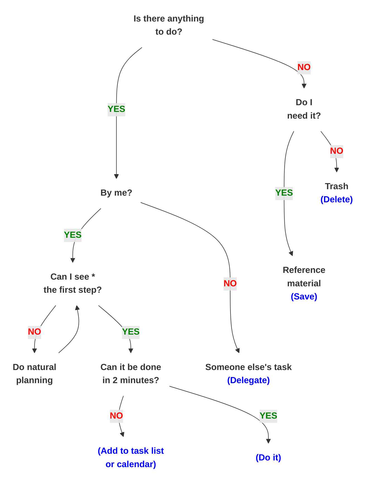

## Processing Inbox

Processing means sorting things into the right places (not dropping everything and doing it right away)

```mermaid
flowchart TD
	classDef transparent fill:none,stroke-width:0px,font-weight:bold;

    A(Is there anything<br/>to do?)
    B(By me?)
    C(Do I<br/>need it?)
    G("Can I see *<br/>the first step?")
    H(Do natural<br/>planning)
    I(Can it be done<br/>in 2 minutes?)

    D("Trash<br/><span style='color:blue'>(Delete)</span>")
    E("Reference<br/>material<br/><span style='color:blue'>(Save)</span>")
    F("Someone else's task<br/><span style='color:blue'>(Delegate)</span>")
    J("<span style='color:blue'>(Add to task list<br/>or calendar)</span>")
    K("<span style='color:blue'>(Do it)</span>")

    A -->|YES| B
    A -->|NO| C
    C -->|NO| D
    C -->|YES| E
    B -->|NO| F
    B -->|YES| G
    G -->|NO| H
    H --> G
    G -->|YES| I
    I -->|YES| K
    I -->|NO| J

    %% invisible links — align the right column of outcomes top to bottom
    D ~~~ E ~~~ F ~~~ J

    class A,B,C,D,E,F,G,H,I,J,K transparent;
    linkStyle 0,3,5,8,9 color:green,font-weight:bold,fill:none
    linkStyle 1,2,4,6,10 color:red,font-weight:bold,fill:none
```

\* _Doable in 30 minutes max with half your brain._
