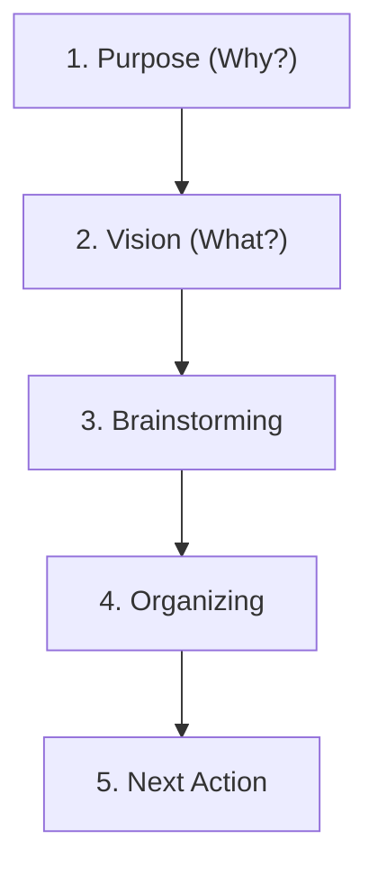

## Natural Planning

The brain plans any endeavor in five steps — from intention to concrete action. Use this model for projects of any scale.

## 1. Purpose (Why?)

Define why this goal matters. What problem does it solve? What outcome will it bring?

Your standards and values are an equally important criterion for achieving a goal. You are always guided by them, even when you don't realize it. And if they are violated, the result will inevitably be stress and pointless anxiety.

## 2. Vision (What?)

Envision the end result. What will you see when the project is complete? How will you know the goal has been achieved?

To fully mobilize all available resources, conscious and unconscious, you need a clear picture of what success looks like. Purpose and principles define the motivation and control process, while the vision actually paints a preliminary picture of the result. This answers the question "what?", not "why?". What will this project or situation look like when it is successfully brought to life?

## 3. Brainstorming

Write down all ideas without filtering. Quantity over quality. Don't evaluate — just capture.

**Rules:**
- Don't criticize ideas
- Aim for quantity
- Write down everything, even the weird stuff

## 4. Organizing

What needs to happen to achieve the final result? In what order? What does the success of the entire project depend on?

Identify key components, determine the sequence, set priorities.

- Group ideas by theme
- Identify dependencies
- Define stages

## 5. Next Action

Identify a concrete action, doable in 30 minutes max with half your brain, that moves you closer to achieving the goal and completing the project.
