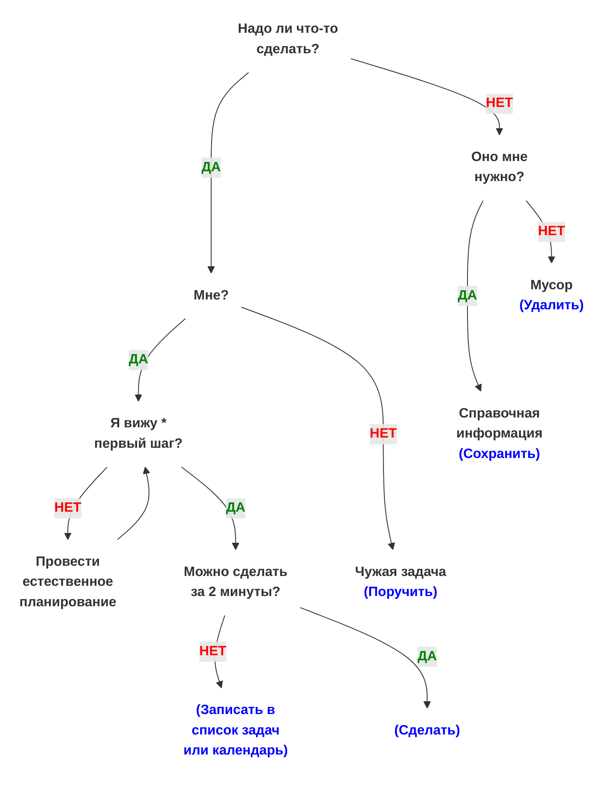

## Обработка входящих

Обработать - это разложить по своим местам (а не бросить всё и сделать)

```mermaid
flowchart TD
	classDef transparent fill:none,stroke-width:0px,font-weight:bold;
	
    A(Надо ли что-то<br/>сделать?)
    B(Мне?)
    C(Оно мне<br/>нужно?)
    G("Я вижу *<br/>первый шаг?")
    H(Провести<br/>естественное<br/>планирование)
    I(Можно сделать<br/>за 2 минуты?)

    D("Мусор<br/><span style='color:blue'>(Удалить)</span>")
    E("Справочная<br/>информация<br/><span style='color:blue'>(Сохранить)</span>")
    F("Чужая задача<br/><span style='color:blue'>(Поручить)</span>")
    J("<span style='color:blue'>(Записать в<br/>список задач<br/>или календарь)</span>")
    K("<span style='color:blue'>(Сделать)</span>")

    A -->|ДА| B
    A -->|НЕТ| C
    C -->|НЕТ| D
    C -->|ДА| E
    B -->|НЕТ| F
    B -->|ДА| G
    G -->|НЕТ| H
    H --> G
    G -->|ДА| I
    I -->|ДА| K
    I -->|НЕТ| J
    
    %% невидимые связи — выстраивают правую колонку исходов сверху вниз
    D ~~~ E ~~~ F ~~~ J
    
    class A,B,C,D,E,F,G,H,I,J,K transparent;
    linkStyle 0,3,5,8,9 color:green,font-weight:bold,fill:none
    linkStyle 1,2,4,6,10 color:red,font-weight:bold,fill:none
```

\* _Выполним максимум за 30 минут половиной мозга._
