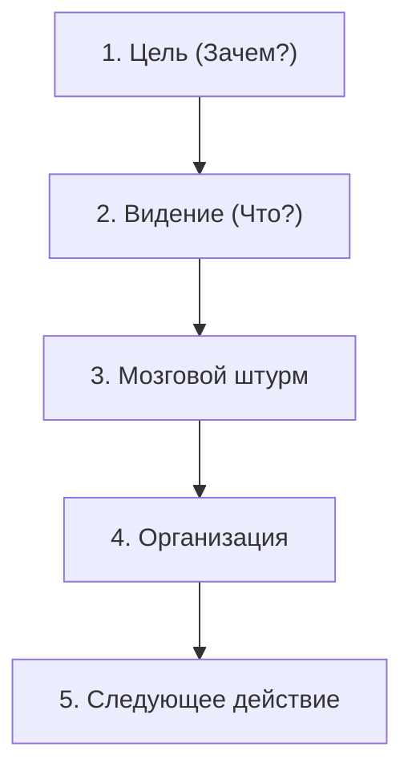

## Естественное планирование

Мозг планирует любое дело в пять шагов - от намерения до конкретного действия. Используй эту модель для проектов любого масштаба.

## 1. Цель (Зачем?)

Определи, зачем эта цель нужна. Какую проблему решает? Какой результат принесёт?

Твои стандарты и ценности – не менее важный критерий достижения цели. Ты руководствуешься ими всегда, даже когда не отдаёшь себе в этом отчета. И если они нарушаются, итогом непременно будет стресс и бесполезная тревога.

## 2. Видение (Что?)

Представь конечный результат. Что ты увидишь, когда проект завершён? Как поймёшь, что цель достигнута?

Для предельной мобилизации всех доступных ресурсов, сознательных и бессознательных, необходимо иметь четкое представление о том, что такое успех. Цель и принципы определяют стимул и процесс контроля, а видение фактически рисует предварительную картину результата. Это ответ на вопрос «что?», а не «зачем?». Какими будут этот проект или ситуация, когда они успешно воплотятся в жизнь?

## 3. Мозговой штурм

Запиши все идеи без фильтрации. Количество важнее качества. Не оценивай, а просто фиксируй.

**Правила:**
- Не критикуй идеи
- Стремись к количеству
- Записывай всё, даже странное

## 4. Организация

Что должно произойти для получения итогового результата? В какой последовательности? От чего зависит достижение цели, успех всего проекта?

Выдели ключевые компоненты, определи последовательность, расставь приоритеты.

- Сгруппируй идеи по темам
- Определи зависимости
- Выдели этапы

## 5. Следующее действие

Определи конкретное действие, выполнимое максимум за 30 минут половиной мозга, которое приблизит к достижению цели, завершению проекта.
